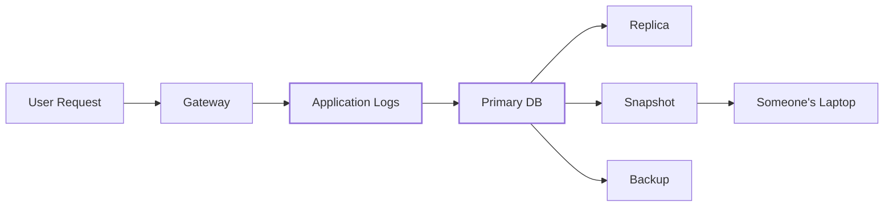
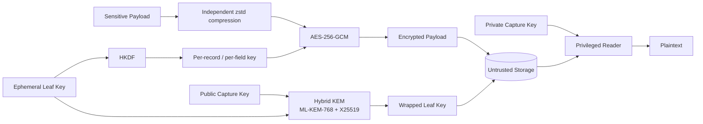
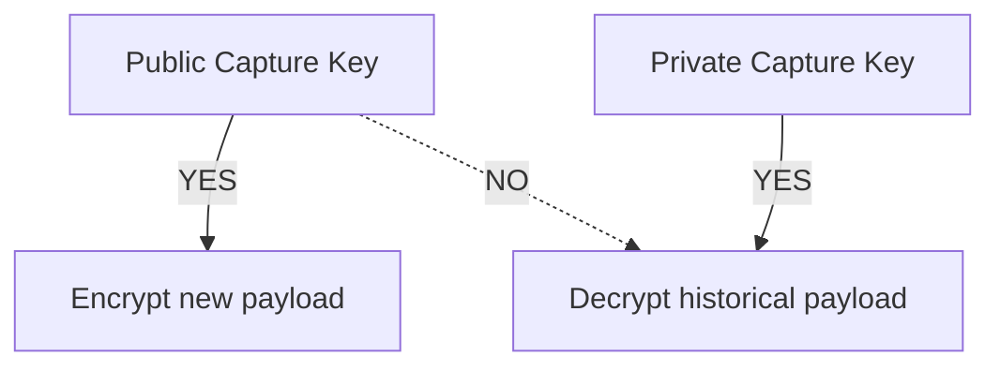

# scuttle

```text
$ cat scuttle

 ███████╗ ██████╗██╗   ██╗████████╗████████╗██╗     ███████╗
 ██╔════╝██╔════╝██║   ██║╚══██╔══╝╚══██╔══╝██║     ██╔════╝
 ███████╗██║     ██║   ██║   ██║      ██║   ██║     █████╗
 ╚════██║██║     ██║   ██║   ██║      ██║   ██║     ██╔══╝
 ███████║╚██████╗╚██████╔╝   ██║      ██║   ███████╗███████╗
 ╚══════╝ ╚═════╝ ╚═════╝    ╚═╝      ╚═╝   ╚══════╝╚══════╝

 Kleine, hybride Post-Quanten-Verschlüsselung für sensible Daten.

 > Überall versiegeln.
 > Woanders öffnen.
 > Datenbank gestohlen? Du bekommst Chiffretext.
 >
 > BITTE BRICH ES.
```

[](https://go.dev/)
[](LICENSE)
[](#die-kryptografische-konstruktion)
[](#die-kryptografische-konstruktion)
[](#status)

<p align="center">
  <a href="README.md">English</a> ·
  <a href="README.zh-CN.md">简体中文</a> ·
  <a href="README.ja.md">日本語</a> ·
  <a href="README.ko.md">한국어</a> ·
  <b>Deutsch</b> ·
  <a href="README.fr.md">Français</a> ·
  <a href="README.es.md">Español</a>
</p>


`scuttle` ist eine Open-Source-Verschlüsselungsschicht für sensible Anwendungslogs.

Sie ist für Systeme gedacht, in denen Anfrage- und Antwort-Payloads
vorübergehend einsehbar sein müssen, Kopien davon aber jahrelang in
Datenbanken, Replikaten, Snapshots und Backups überdauern können.

Die normale Anwendungsflotte erhält **nur einen öffentlichen Capture-Schlüssel**.
Damit kann sie neue Logs verschlüsseln, aber keine historischen entschlüsseln.

Langlebiges Schlüsselmaterial wird durch eine **hybride Post-Quanten-Konstruktion
aus ML-KEM-768 + X25519** geschützt, während Payloads mit **AES-256-GCM** und
unabhängig abgeleiteten Feldschlüsseln verschlüsselt werden.

> **scuttle wird bei [OrcaRouter](https://www.orcarouter.ai/) als quantensichere
> Verschlüsselungsschicht für sensible Log-Payloads eingesetzt.**
>
> Die Open-Source-Bibliothek wird veröffentlicht, damit die Konstruktion
> öffentlich geprüft, gefuzzt, angegriffen und verbessert werden kann.

---

## Brich es.

**Wir wollen, dass Leute das angreifen.**

Kryptografie wird stärker, wenn ihre Annahmen explizit sind und Menschen einen
Anreiz haben, herauszufinden, wo sie versagen.

[`ATTACK.md`](ATTACK.md) listet die Sicherheitseigenschaften auf, die das System
unserer Überzeugung nach bietet – geordnet danach, wie teuer es für uns wäre,
falschzuliegen –, zusammen mit Fuzz-Zielen, die auf genau diese Annahmen zielen.

Etwas gefunden?

→ Lies [`SECURITY.md`](SECURITY.md)  
→ Reproduziere es  
→ Brich eine Invariante  
→ Sag uns, was wir falsch gemacht haben

## Status

> **v0 — nicht unabhängig auditiert.**
>
> Das Wire-Format ist nicht stabil. Verwende dies noch nicht für Daten, deren
> Verlust oder dauerhafte Unlesbarkeit du dir nicht leisten kannst.

---

# Warum „scuttle“?

Ein Schiff zu **scuttlen** (selbst zu versenken) heißt, es absichtlich
unbrauchbar zu machen, bevor ein Gegner es kapern kann.

Scuttle wendet dieselbe Idee auf sensible Daten an.

```text
             attacker captures storage

                       │
                       ▼

              ┌─────────────────┐
              │    DATABASE     │
              │                 │
              │  █ ciphertext   │
              │  █ wrapped keys │
              │  █ metadata     │
              └────────┬────────┘
                       │
                       │  no capture private key
                       ▼

                 ┌───────────┐
                 │ ¯\_(ツ)_/¯ │
                 └───────────┘

               got the database.
                 not the data.
```

---

# Das Problem

KI-Infrastruktur erzeugt ungewöhnlich sensible Logs.

Eine einzige Anfrage kann Folgendes enthalten:

- Prompts
- Modellantworten
- Quellcode
- API-Ausgaben
- abgerufene Dokumente
- personenbezogene Daten (PII)
- versehentlich in den Kontext geratene Zugangsdaten
- Tool-Aufrufe von Agenten
- proprietäre Unternehmensdaten

Eine normale Logging-Architektur sieht früher oder später so aus:



Eine Zeile nach 30 Tagen zu löschen, löscht nicht zwangsläufig das Backup von
gestern, einen Oplog-Eintrag, ein hinterherhinkendes Replikat oder einen alten
Snapshot.

Eine Verschlüsselung allein auf der Speicherebene bedeutet außerdem: Wer den
normalen Entschlüsselungspfad der Datenbank erlangt, erlangt womöglich auch den
Klartext.

`scuttle` verlagert die Verschlüsselung **vor die Speicherung**.

---

# Die Architektur



Die entscheidende Grenze ist:

```text
┌──────────────────────── ORCAROUTER DATA PLANE ────────────────────────┐
│                                                                       │
│  API Gateway      Workers       Relays       Logging Infrastructure   │
│      │               │             │                  │               │
│      └───────────────┴─────────────┴──────────────────┘               │
│                              │                                        │
│                    PUBLIC CAPTURE KEY ONLY                             │
│                              │                                        │
│                        can encrypt                                    │
│                     cannot open history                               │
│                                                                       │
└──────────────────────────────┬────────────────────────────────────────┘
                               │
                               ▼
                    ┌─────────────────────┐
                    │  UNTRUSTED STORAGE  │
                    │                     │
                    │  encrypted payload  │
                    │  wrapped leaf key   │
                    │  metadata           │
                    └──────────┬──────────┘
                               │
                  separate trust boundary
                               │
                               ▼
                    ┌─────────────────────┐
                    │ PRIVILEGED READER   │
                    │                     │
                    │ capture private key │
                    │ access controls     │
                    │ audit boundary      │
                    └─────────────────────┘
```

Ein Datenbank-Zugangsdatum ist daher nicht dazu gedacht, zugleich ein
Zugangsdatum zur Entschlüsselung historischer Prompts zu sein.

---

# Die kryptografische Konstruktion

scuttle ersetzt **nicht** jedes Primitiv durch ein Post-Quanten-Primitiv.

Es setzt Post-Quanten-Kryptografie dort ein, wo die langfristige
Quantenbedrohung tatsächlich eine Rolle spielt.

```text
                         SCUTTLE

 Payload
    │
    ▼
┌──────────────┐
│     zstd     │       compress independently
└──────┬───────┘
       │
       ▼
┌──────────────┐
│ AES-256-GCM  │ ◀──── HKDF-derived field key
└──────┬───────┘
       │
       ▼
  Ciphertext
       │
       │ stored together with
       ▼
┌──────────────────────────────┐
│ Wrapped Leaf Key             │
│                              │
│ ML-KEM-768  ─┐               │
│              ├─ Hybrid KEM   │
│ X25519 ──────┘               │
│                              │
│        X-Wing construction   │
└──────────────────────────────┘
```

## Warum AES-256?

Die Payload-Verschlüsselung verwendet **AES-256-GCM**.

Ein künftiger kryptografisch relevanter Quantencomputer würde die
Sicherheitsanalyse symmetrischer Kryptografie anders verändern als die von
Public-Key-Kryptografie. Grovers Algorithmus liefert eine generische,
quadratische Beschleunigung der Suche – nicht die Art von Bruch, die Shors
Algorithmus für weit verbreitete klassische Public-Key-Systeme bedeutet.

Ein 256-Bit-Schlüssel bietet daher eine erhebliche Sicherheitsreserve für
langlebige verschlüsselte Daten.

Es gibt keinen Grund, ML-KEM über jedes Byte eines Prompts laufen zu lassen.

Verwende symmetrische Kryptografie für die Daten.

Verwende Post-Quanten-Kryptografie, um die Schlüssel zu schützen.

---

## Warum ML-KEM-768?

Das langfristige Risiko liegt an der Grenze der Schlüsselkapselung.

Ein Angreifer kann verschlüsselten Verkehr oder Backups **heute** kopieren,
aufbewahren und später zu entschlüsseln versuchen, falls die Kryptografie, die
ihre Schlüssel schützt, brechbar wird.

Das ist die Bedrohung **„Jetzt sammeln, später entschlüsseln“** (harvest now, decrypt later).

```text
2026                                      FUTURE

capture encrypted logs
        │
        ▼
██████████████████████████████████████████████►
        │                                      │
        │ keep ciphertext                      │
        │                                      ▼
        │                              cryptographically
        │                              relevant quantum
        │                              computers?
        │                                      │
        └──────────────────────────────────────┘
                         try to decrypt history
```

scuttle kapselt Leaf-Schlüssel daher mit **ML-KEM-768**, einem
Post-Quanten-Mechanismus zur Schlüsselkapselung.

---

## Warum hybrid ML-KEM-768 + X25519?

Weil es eine andere Art von Risiko schafft, ein ausgereiftes Primitiv durch ein
neueres zu ersetzen.

scuttle kombiniert:

```text
        ML-KEM-768
             │
             ├──────► HYBRID SECRET
             │
          X25519
```

über die hybride **X-Wing**-Konstruktion.

Das Ziel ist gestaffelte Verteidigung (Defense in Depth):

| Komponente | Zweck |
|---|---|
| **ML-KEM-768** | Schutz vor künftigen Quantenangriffen |
| **X25519** | Ausgereifte klassische Sicherheit auf Basis elliptischer Kurven |
| **Hybride Konstruktion** | Keine ausschließliche Abhängigkeit von einer der beiden Annahmen |
| **AES-256-GCM** | Authentifizierte Payload-Verschlüsselung |
| **HKDF** | Domänengetrennte Ableitung der Feldschlüssel |
| **AAD** | Bindet den Chiffretext kryptografisch an seinen Kontext |

Deshalb bezeichnet sich scuttle als **hybride Post-Quanten-Verschlüsselung**,
statt einfach X25519 durch ML-KEM zu ersetzen.

---

# Was genau wird verschlüsselt?

Jedes sensible Feld wird unabhängig verschlüsselt.

Für einen konzeptionellen Datensatz:

```json
{
  "request_id": "req_01JQ8F7YKX2M",
  "model": "example/model",
  "status": 200,

  "request_body":  "<encrypted>",
  "response_body": "<encrypted>"
}
```

leitet scuttle für jedes Feld einen eigenen AES-256-Schlüssel ab:

```text
(leaf, record, request_body)
            │
            └── HKDF ──► AES key A

(leaf, record, response_body)
            │
            └── HKDF ──► AES key B
```

Inhaltsschlüssel werden **abgeleitet, nicht gespeichert**.

Ein einzelner geleakter Feldschlüssel wird daher nicht zu einem universellen
Entschlüsselungsschlüssel für die Datenbank.

---

# Chiffretext gehört zu seinem Kontext

Die Datenbank gilt als nicht vertrauenswürdig.

Die Associated Data von AES-GCM bindet einen Chiffretext an:

```text
schema version
      +
epoch
      +
leaf
      +
tenant / workspace
      +
user
      +
record ID
      +
field name
```

Diese Werte werden vor der Authentifizierung eindeutig kodiert.

Ein Angreifer sollte also nicht in der Lage sein, folgenden Chiffretext zu nehmen:

```text
Tenant A
Request 123
response_body
```

ihn zu verpflanzen nach:

```text
Tenant B
Request 456
request_body
```

und ihn dort erfolgreich authentifizieren zu lassen.

Die Datenbank speichert den Chiffretext.

Sie darf aber nicht umdefinieren, was dieser Chiffretext bedeutet.

---

# Zeilen authentifizieren: `AuthKey`

Die Bindung hindert einen Angreifer daran, einen Chiffretext zu **verschieben**.
Für sich allein hindert sie ihn nicht daran, **einen neuen zu schreiben**.

Der Capture-Schlüssel ist absichtlich öffentlich. Wer in deinen Speicher
schreiben kann, kann sich daher ein eigenes Leaf erzeugen, beliebigen Text unter
der Bindung eines beliebigen Mandanten versiegeln und ihn einfügen. Ohne
Authentifizierungsschlüssel lässt sich diese Zeile sauber öffnen und sieht genau
wie ein echtes Log aus – was relevant ist, sobald irgendetwas nachgelagert
(ein Support-Tool, ein Analyse-Job, ein LLM, das seine eigenen Logs liest) dem
Gelesenen vertraut.

`Envelope.AuthKey` schließt diese Lücke:

```go
env := scuttle.Envelope{
    MaxPlaintext: 256 << 10,
    AuthKey:      authKey, // 32 secret bytes, writers + readers, never stored with data
}
```

Mit einem `AuthKey` wird der Feldschlüssel zu
`HKDF(salt = AuthKey, ikm = leaf key, info = binding)`. Ein Fälscher wählt
seinen eigenen Leaf-Schlüssel, kennt aber den `AuthKey` nicht, kann also weder
den Feldschlüssel ableiten noch ein Tag erzeugen, das der Leser akzeptiert.

Was es bringt und was nicht:

| | Ohne `AuthKey` | Mit `AuthKey` |
|---|---|---|
| Gestohlenen Dump lesen | ❌ nein | ❌ nein |
| Chiffretext zu anderem Mandanten / Datensatz / Feld verschieben | ❌ scheitert | ❌ scheitert |
| Schreibender mit Speicherzugriff **fügt neue Zeile ein** | ⚠️ **öffnet sich als echt** | ❌ scheitert |
| Kompromittierter Schreiber fügt Zeile ein | ⚠️ ja | ⚠️ ja — er besitzt den Schlüssel und könnte ohnehin falsche Logs schreiben |
| Schreibender mit Speicherzugriff **löscht** oder **unterschlägt** eine Zeile | ⚠️ ja | ⚠️ ja — Verschlüsselung kann Löschen nicht verhindern |

Das Einschalten ist eine **Umstellung** (Cutover). Ein Leser mit `AuthKey`
weist Zeilen zurück, die ohne ihn versiegelt wurden; andernfalls würde ein
Fälscher einfach unauthentifizierte Zeilen schreiben. Verwende für
authentifizierte Zeilen eine neue `Binding.SchemaVersion`, damit der Leser weiß,
mit welchem Envelope er jede Zeile öffnen muss.

Der `AuthKey` ist symmetrisch und 256 Bit lang, bringt also keine zusätzliche
Angriffsfläche für Quantencomputer mit sich.

---

# Reines Schreiben beim Capture

Das ist eine der wichtigsten Eigenschaften des Designs.

Der normale Schreiber erhält:

```text
PUBLIC CAPTURE KEY
```

nicht:

```text
DATABASE MASTER DECRYPTION KEY
```

Also:



Ein Relay, Gateway oder Worker kann daher Daten verschlüsseln, ohne automatisch
die Fähigkeit zu erhalten, die historische Log-Datenbank zu entschlüsseln.

Deshalb trennt die API

```go
LeafSealer
```

von:

```go
Keyring
```

Beide Seiten in denselben Prozess zu legen, zerstört diese Vertrauenstrennung.

---

# Jeder Datensatz ist in sich geschlossen

Jeder gespeicherte Datensatz trägt seinen eigenen gekapselten Leaf-Schlüssel.

```text
┌────────────────────────────────────────┐
│ Stored Record                          │
│                                        │
│ metadata                               │
│ encrypted request                     │
│ encrypted response                    │
│ wrapped leaf key                      │
│ capture-key generation                │
└────────────────────────────────────────┘
```

Es gibt keine In-Memory-Datenbank zur Schlüsselverteilung, die neben der
Anwendung überleben muss.

Leser, die den passenden privaten Capture-Schlüssel besitzen, können den
Leaf-Schlüssel wiederherstellen nach:

- Prozessneustarts
- Deployments
- Wechseln von Replikaten
- Failover
- Austausch von Maschinen

---

# Schlüsselrotation

Capture-Schlüssel kennen ihre Generation.

```text
Generation 3      ACTIVE
Generation 2      decrypt only
Generation 1      decrypt only
```

Rotation sieht dann so aus:

```go
// seeds[0] is ACTIVE — what NewLeaf seals under.
// Remaining seeds only open historical records.

keyring, _ := scuttle.NewLocalKeyringMulti(
    [][]byte{newSeed, oldSeed},
)
```

Neue Datensätze verwenden den neuesten Capture-Schlüssel.

Alte Datensätze bleiben lesbar, solange der zugehörige ausgemusterte Schlüssel
im Keyring verbleibt.

Sobald die Aufbewahrungsfrist alles beseitigt hat, was durch eine alte
Generation geschützt war, kann diese Generation entfernt werden.

Wiederholte Seeds werden zurückgewiesen, statt stillschweigend eine Rotation
vorzutäuschen, die gar nicht stattgefunden hat.

Zeilen, die geschrieben wurden, bevor Datensätze einen Generationsstempel trugen
(`KemKeyID` leer), werden gegen jede Generation im Keyring geprüft, die aktive
zuerst. Das ist sicher, weil das HPKE-Öffnen authentifiziert ist: Die falsche
Generation scheitert an ihrem Tag, statt einen falschen Schlüssel zu liefern.

---

# Komprimierung erfolgt vor der Verschlüsselung

```text
plaintext
   │
   ▼
 zstd
   │
   ▼
AES-256-GCM
   │
   ▼
ciphertext
```

Verschlüsselte Daten sind praktisch nicht komprimierbar.

Erst zu komprimieren verhindert, dass die Komprimierung der Speicher-Engine
wirkungslos wird.

Jedes Feld wird unabhängig komprimiert. scuttle erzeugt bewusst keinen
gemeinsamen Komprimierungskontext, in dem vom Angreifer kontrollierte Daten
eines Mandanten zusammen mit dem Geheimnis eines anderen Mandanten komprimiert
werden.

---

# Verwendung

```go
// ─────────────────────────────────────────────────────────────
// WRITER
//
// Holds a PUBLIC capture key.
// Can seal new data.
// Cannot use that key to open historical data.
// ─────────────────────────────────────────────────────────────

// Keys: `go run ./cmd/scuttle-keygen` prints a fresh set.
capturePublicKey, _ := scuttle.ParsePublicKey(os.Getenv("SCUTTLE_CAPTURE_PUBLIC_KEY"))
authKey, _ := scuttle.ParseAuthKey(os.Getenv("SCUTTLE_AUTH_KEY"))

sealer, _ := scuttle.NewLeafSealer(capturePublicKey)

leafKey, sealed, _ := sealer.NewLeaf(
    "tenant:42|user:7|2026-09-12T10",
)

// Keep leafKey in memory only for the chosen lifetime.
// Store sealed.Blob with the record.

// Writers and readers must use the same Envelope configuration.
// Seal refuses a body over MaxPlaintext (ErrPlaintextTooLarge) rather than
// writing a row Open would refuse.
env := scuttle.Envelope{
    MaxPlaintext: 256 << 10,
    AuthKey:      authKey,
}

bind := scuttle.Binding{
    SchemaVersion: 1,
    LeafID:        sealed.LeafID,
    WorkspaceID:   42,
    UserID:        7,
    RequestID:     "req_01JQ8F7YKX2M",
}

ct, _ := env.Seal(
    leafKey,
    bind,
    scuttle.FieldRequestBody,
    payload,
)
```

Das Öffnen geschieht auf der privilegierten Seite:

```go
// ─────────────────────────────────────────────────────────────
// READER
//
// Privileged.
// Keep this trust boundary away from ordinary writers.
// ─────────────────────────────────────────────────────────────

seed, _ := scuttle.ParseCaptureSeed(os.Getenv("SCUTTLE_CAPTURE_SEED"))

keyring, _ := scuttle.NewLocalKeyring(seed)

key, err := keyring.OpenLeaf(ctx, sealed)

switch {
case errors.Is(err, scuttle.ErrKeyUnavailable):
    // Retryable: a remote keyring is unreachable, or ctx ended.

case errors.Is(err, scuttle.ErrUndecryptable):
    // NOT retryable.
    // Treat this as a fault worth investigating.
}

defer zero(key)

plaintext, err := env.Open(
    key,
    bind,
    scuttle.FieldRequestBody,
    ct,
)
```

---

# Fehlersemantik ist wichtig

Diese beiden Fehler bedeuten bewusst Unterschiedliches.

### `ErrKeyUnavailable`

Die Entschlüsselungsinfrastruktur kann den benötigten Schlüssel derzeit nicht
bereitstellen.

**Möglicherweise wiederholbar.**

### `ErrUndecryptable`

Der Datensatz kann in der vorliegenden Form nicht entschlüsselt werden.

**Kein normaler Fall für einen erneuten Versuch. Untersuche ihn.**

Wer die beiden vermischt, lässt Infrastrukturausfälle wie Datenkorruption
aussehen – oder, schlimmer, macht aus echten kryptografischen Fehlern endlose
Wiederholungsversuche.

Eine Zeile ganz ohne versiegeltes Leaf ist `ErrUndecryptable`: Jeder Datensatz
trägt sein eigenes, Warten wird also keines hervorbringen.

Zwei weitere Fehler beschreiben **deinen Code**, nicht eine Zeile:

- **`ErrPlaintextTooLarge`** — `Seal` hat einen Inhalt über der Obergrenze des
  Envelopes erhalten. Es wurde nichts geschrieben.
- **`ErrInvalidConfig`** — ein `AuthKey` mit falscher Größe oder nur aus
  Nullen, ein `MaxPlaintext` über `MaxPlaintextCeiling` (16 MiB) oder ein
  fehlerhafter Schlüssel-String. Korrigiere das Deployment.

Eine vollständige, ausführbare Version dieses Abschnitts findest du in
[`example_test.go`](example_test.go).

---

# Bedrohungsmodell

scuttle soll den Ausgang von Szenarien wie diesen verbessern:

| Ereignis | Beabsichtigtes Ergebnis |
|---|---|
| Datenbank-Zugangsdaten gestohlen | Payload bleibt verschlüsselt |
| Datenbank-Dump gestohlen | Payload bleibt verschlüsselt |
| Backup geleakt | Payload bleibt verschlüsselt |
| Snapshot offengelegt | Payload bleibt verschlüsselt |
| Speicheradministrator liest die DB | Kein Payload-Klartext allein aus dem Speicher |
| Schreiber kompromittiert | Historische Datenbank nicht automatisch mit dem öffentlichen Capture-Schlüssel entschlüsselbar |
| Chiffretext zwischen Mandanten verschoben | Authentifizierung scheitert |
| Vorhandener Chiffretext verändert | Authentifizierung scheitert |
| Schreibender mit Speicherzugriff fügt eine **neue, gefälschte** Zeile ein | Scheitert **nur mit `Envelope.AuthKey`**; ohne ihn öffnet sich die Zeile als echt |
| Künftiger Quantenangriff auf klassischen Schlüsselaustausch | Die ML-KEM-Schicht bietet PQ-Schutz |

Die letzte Zeile ist der Grund, warum es die Post-Quanten-Schicht gibt.

---

# Was scuttle **nicht** schützt

Sicherheitsaussagen sind nützlicher, wenn ihre Grenzen explizit sind.

### Es löscht keine Daten

Verschlüsselungsschlüssel zu vernichten, damit historischer Chiffretext dauerhaft
unlesbar wird – **kryptografisches Löschen** –, ist ein eigenes Problem.

### Es verbirgt keine Metadaten

Informationen, die für Abfragen nötig sind, können sichtbar bleiben, etwa:

- Zeitstempel
- Payload-Größen
- Modellnamen
- Statuscodes
- Kennungen

Ein Angreifer mit Datenbankzugriff kann dennoch wichtige Verkehrsmetadaten
erfahren.

### Es schützt keinen Klartext im Prozessspeicher

Die Anwendung sieht den Klartext zwangsläufig, während sie ihn verarbeitet.

Ein kompromittierter Prozess, ein Speicherabbild, ein Debugger oder eine
ausreichend privilegierte Laufzeit-Instrumentierung kann diesen Klartext sehen.

### Es hält keinen autorisierten Leser auf

Ist eine Identität legitim berechtigt, Klartext anzufordern, bleibt die
Zugriffskontrolle dafür verantwortlich zu entscheiden, ob diese Anfrage zulässig
ist.

scuttle schützt kryptografisches Material.

Es ist kein Autorisierungssystem.

### Ein prozessinterner Keyring ist nicht schreibexklusiv

Hält der Schreiberprozess auch den privaten Capture-Schlüssel, liefert eine
Kompromittierung dieses Prozesses jeden historischen Datensatz, nicht nur sein
aktuelles Leaf-Fenster. Die Eigenschaft des reinen Schreibens besteht nur, wenn
der Capture-Seed an einem Ort liegt, auf den die Schreiber keinen Zugriff haben:
in einem separaten Lesedienst oder in einem KMS / HSM hinter deiner eigenen
Implementierung des `Keyring`-Interfaces.

### Es bietet keine Forward Secrecy

Der Capture-Seed ist ein einziges langlebiges Wurzelgeheimnis. Wer ihn erlangt –
heute oder im Jahr 2040 –, kann jeden noch existierenden Datensatz öffnen, der
unter seinem öffentlichen Schlüssel versiegelt wurde. Die Post-Quanten-Kapselung
schützt vor jemandem, der den Seed **nicht** hat; gegen jemanden, der ihn hat,
hilft sie nicht. Bewahre den Seed in einem KMS oder HSM auf, gib ihn an so wenige
Prozesse wie möglich, rotiere ihn und lass die Aufbewahrungsfristen löschen, was
alte Generationen geschützt haben.

### Es authentifiziert Zeilen standardmäßig nicht

Ohne `Envelope.AuthKey` kann jeder, der in den Speicher schreiben kann, eine
Zeile einfügen, die sich als echt entschlüsseln lässt. Siehe
[Zeilen authentifizieren](#zeilen-authentifizieren-authkey).

### Es verhindert weder Löschen noch Rollback

Ein Angreifer mit Schreibzugriff kann Zeilen löschen oder zurückhalten.
Verschlüsselung kann eine Zeile, die nicht da ist, nicht erkennen.

### Es ist nicht auditiert

scuttle ist **v0 und wurde nicht unabhängig auditiert**. Die Primitive sind
Standard (`crypto/hpke`, AES-GCM, HKDF aus dem Go-Projekt), aber die Art, wie sie
kombiniert werden, stammt von uns. [`SPEC.md`](SPEC.md) beschreibt das Format
präzise, und [`ATTACK.md`](ATTACK.md) listet die Aussagen auf, bei denen sich ein
Angriffsversuch lohnt.

---

# Weiterführende Lektüre

- [`SPEC.md`](SPEC.md) — das Wire-Format, Byte für Byte, mit Testvektoren in
  [`testdata/vectors.json`](testdata/vectors.json).
- [`ATTACK.md`](ATTACK.md) — die Aussagen und die Fuzz-Ziele, die auf sie zielen.
- [`SECURITY.md`](SECURITY.md) — wie man einen Fund meldet.
- [`CHANGELOG.md`](CHANGELOG.md) — was sich geändert hat, einschließlich Formatänderungen.
- [`CONTRIBUTING.md`](CONTRIBUTING.md) — wie man daran mitarbeitet.

Lizenziert unter der [Apache License 2.0](LICENSE).
