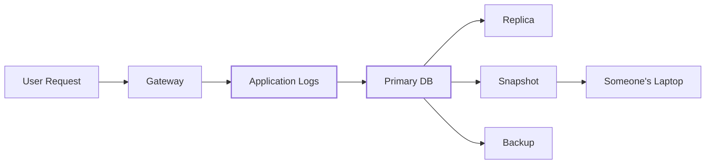
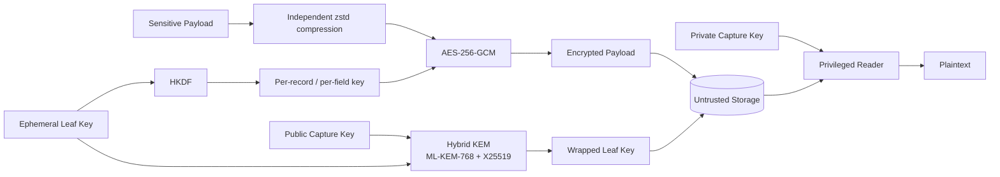
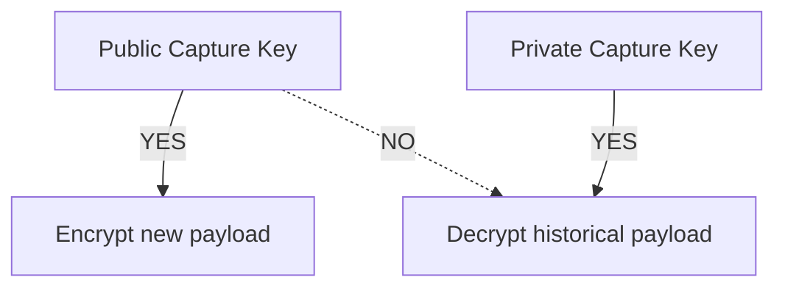

# scuttle

```text
$ cat scuttle

 ███████╗ ██████╗██╗   ██╗████████╗████████╗██╗     ███████╗
 ██╔════╝██╔════╝██║   ██║╚══██╔══╝╚══██╔══╝██║     ██╔════╝
 ███████╗██║     ██║   ██║   ██║      ██║   ██║     █████╗
 ╚════██║██║     ██║   ██║   ██║      ██║   ██║     ██╔══╝
 ███████║╚██████╗╚██████╔╝   ██║      ██║   ███████╗███████╗
 ╚══════╝ ╚═════╝ ╚═════╝    ╚═╝      ╚═╝   ╚══════╝╚══════╝

 cifrado híbrido poscuántico y diminuto para datos sensibles.

 > sella en todas partes.
 > abre en otro lugar.
 > roba la base de datos, obtén texto cifrado.
 >
 > INTENTA ROMPERLO.
```

[](https://go.dev/)
[](LICENSE)
[](#la-construcción-criptográfica)
[](#la-construcción-criptográfica)
[](#estado)

<p align="center">
  <a href="README.md">English</a> ·
  <a href="README.zh-CN.md">简体中文</a> ·
  <a href="README.ja.md">日本語</a> ·
  <a href="README.ko.md">한국어</a> ·
  <a href="README.de.md">Deutsch</a> ·
  <a href="README.fr.md">Français</a> ·
  <b>Español</b>
</p>


`scuttle` es una capa de cifrado de código abierto para los registros sensibles de las aplicaciones.

Está diseñada para sistemas en los que las cargas útiles de peticiones y
respuestas deben ser observables temporalmente, pero cuyas copias pueden
sobrevivir durante años en bases de datos, réplicas, instantáneas y copias de
seguridad.

La flota normal de aplicaciones recibe **solo una clave pública de captura**.
Puede cifrar registros nuevos, pero no puede usar esa clave para descifrar los
históricos.

El material de claves de larga duración se protege con una **construcción
híbrida poscuántica que usa ML-KEM-768 + X25519**, mientras que las cargas
útiles se cifran con **AES-256-GCM** usando claves de campo derivadas de forma
independiente.

> **scuttle es la capa de cifrado poscuántico híbrido para las cargas útiles
> sensibles de los registros en [OrcaRouter](https://www.orcarouter.ai/).**
>
> La biblioteca de código abierto se publica para que la construcción pueda
> inspeccionarse, someterse a fuzzing, atacarse y mejorarse en público.

---

## Rómpelo.

**Queremos que la gente ataque esto.**

La criptografía se fortalece cuando sus supuestos son explícitos y la gente
tiene incentivos para encontrar dónde fallan.

[`ATTACK.md`](ATTACK.md) enumera las propiedades de seguridad que creemos que
ofrece el sistema, ordenadas según lo caro que nos resultaría estar
equivocados, junto con objetivos de fuzzing dirigidos a esos supuestos.

¿Encontraste algo?

→ Lee [`SECURITY.md`](SECURITY.md)  
→ Reprodúcelo  
→ Rompe un invariante  
→ Dinos en qué nos equivocamos

## Estado

> **v0: sin auditoría independiente.**
>
> El formato de transmisión no es estable. No lo uses todavía para datos que no
> puedas permitirte perder o dejar ilegibles para siempre.

---

# ¿Por qué “scuttle”?

**Hundir deliberadamente** (en inglés, *to scuttle*) un barco es inutilizarlo
a propósito antes de que un adversario pueda capturarlo.

Scuttle aplica la misma idea a los datos sensibles.

```text
             attacker captures storage

                       │
                       ▼

              ┌─────────────────┐
              │    DATABASE     │
              │                 │
              │  █ ciphertext   │
              │  █ wrapped keys │
              │  █ metadata     │
              └────────┬────────┘
                       │
                       │  no capture private key
                       ▼

                 ┌───────────┐
                 │ ¯\_(ツ)_/¯ │
                 └───────────┘

               got the database.
                 not the data.
```

---

# El problema

La infraestructura de IA produce registros inusualmente sensibles.

Una sola petición puede contener:

- prompts
- respuestas del modelo
- código fuente
- salida de API
- documentos recuperados
- PII
- credenciales incluidas por accidente en el contexto
- llamadas a herramientas de agentes
- datos propietarios de la empresa

Una arquitectura de registro normal acaba pareciéndose a esto:



Borrar una fila a los 30 días no borra necesariamente la copia de seguridad de
ayer, una entrada del oplog, una réplica atrasada o una instantánea antigua.

Cifrar solo en la capa de almacenamiento también significa que quien obtenga la
ruta de descifrado normal de la base de datos puede obtener el texto plano.

`scuttle` traslada el cifrado a **antes del almacenamiento**.

---

# La arquitectura



La frontera importante es:

```text
┌──────────────────────── ORCAROUTER DATA PLANE ────────────────────────┐
│                                                                       │
│  API Gateway      Workers       Relays       Logging Infrastructure   │
│      │               │             │                  │               │
│      └───────────────┴─────────────┴──────────────────┘               │
│                              │                                        │
│                    PUBLIC CAPTURE KEY ONLY                            │
│                              │                                        │
│                        can encrypt                                    │
│                     cannot open history                               │
│                                                                       │
└──────────────────────────────┬────────────────────────────────────────┘
                               │
                               ▼
                    ┌─────────────────────┐
                    │  UNTRUSTED STORAGE  │
                    │                     │
                    │  encrypted payload  │
                    │  wrapped leaf key   │
                    │  metadata           │
                    └──────────┬──────────┘
                               │
                  separate trust boundary
                               │
                               ▼
                    ┌─────────────────────┐
                    │ PRIVILEGED READER   │
                    │                     │
                    │ capture private key │
                    │ access controls     │
                    │ audit boundary      │
                    └─────────────────────┘
```

Por lo tanto, una credencial de la base de datos no pretende ser una credencial
para descifrar los prompts históricos.

---

# La construcción criptográfica

scuttle **no** reemplaza cada primitiva por una primitiva poscuántica.

Coloca la criptografía poscuántica allí donde la amenaza cuántica a largo plazo
realmente importa.

```text
                         SCUTTLE

 Payload
    │
    ▼
┌──────────────┐
│     zstd     │       compress independently
└──────┬───────┘
       │
       ▼
┌──────────────┐
│ AES-256-GCM  │ ◀──── HKDF-derived field key
└──────┬───────┘
       │
       ▼
  Ciphertext
       │
       │ stored together with
       ▼
┌──────────────────────────────┐
│ Wrapped Leaf Key             │
│                              │
│ ML-KEM-768  ─┐               │
│              ├─ Hybrid KEM   │
│ X25519 ──────┘               │
│                              │
│        X-Wing construction   │
└──────────────────────────────┘
```

## ¿Por qué AES-256?

El cifrado de las cargas útiles usa **AES-256-GCM**.

Un futuro ordenador cuántico criptográficamente relevante cambiaría el análisis
de seguridad de la criptografía simétrica de forma distinta al de la
criptografía de clave pública. El algoritmo de Grover ofrece una mejora
cuadrática genérica en la búsqueda, y no el tipo de ruptura que el algoritmo de
Shor provoca en los sistemas clásicos de clave pública ampliamente desplegados.

Usar una clave simétrica de 256 bits proporciona, por tanto, un margen de
seguridad considerable para datos cifrados de larga duración.

No hay ninguna razón para ejecutar ML-KEM sobre cada byte de un prompt.

Usa criptografía simétrica para los datos.

Usa criptografía poscuántica para proteger las claves.

---

## ¿Por qué ML-KEM-768?

El riesgo a largo plazo está en la frontera de encapsulación de claves.

Un atacante puede copiar tráfico cifrado o copias de seguridad **hoy**,
conservarlos e intentar descifrarlos más adelante si la criptografía que
protege sus claves llega a poder romperse.

Esta es la amenaza de **recolectar ahora, descifrar después** (*harvest-now,
decrypt-later*).

```text
2026                                      FUTURE

capture encrypted logs
        │
        ▼
██████████████████████████████████████████████►
        │                                      │
        │ keep ciphertext                      │
        │                                      ▼
        │                              cryptographically
        │                              relevant quantum
        │                              computers?
        │                                      │
        └──────────────────────────────────────┘
                         try to decrypt history
```

Por eso scuttle envuelve las claves hoja con **ML-KEM-768**, un mecanismo
poscuántico de encapsulación de claves.

---

## ¿Por qué híbrido ML-KEM-768 + X25519?

Porque sustituir una primitiva madura por otra más nueva crea otro tipo de
riesgo.

scuttle combina:

```text
        ML-KEM-768
             │
             ├──────► HYBRID SECRET
             │
          X25519
```

mediante la construcción híbrida **X-Wing**.

El objetivo es la defensa en profundidad:

| Componente | Propósito |
|---|---|
| **ML-KEM-768** | Protección frente a futuros ataques cuánticos |
| **X25519** | Seguridad clásica y madura de curva elíptica |
| **Construcción híbrida** | Evitar depender exclusivamente de cualquiera de los dos supuestos |
| **AES-256-GCM** | Cifrado autenticado de la carga útil |
| **HKDF** | Derivación de claves de campo con separación de dominio |
| **AAD** | Vincula criptográficamente el texto cifrado a su contexto |

Por eso scuttle se describe a sí mismo como **cifrado híbrido poscuántico**, en
lugar de simplemente sustituir X25519 por ML-KEM.

---

# ¿Qué se cifra exactamente?

Cada campo sensible se cifra de forma independiente.

Para un registro conceptual:

```json
{
  "request_id": "req_01JQ8F7YKX2M",
  "model": "example/model",
  "status": 200,

  "request_body":  "<encrypted>",
  "response_body": "<encrypted>"
}
```

scuttle deriva una clave AES-256 distinta para cada uno:

```text
(leaf, record, request_body)
            │
            └── HKDF ──► AES key A

(leaf, record, response_body)
            │
            └── HKDF ──► AES key B
```

Las claves de contenido se **derivan, no se almacenan**.

Así, la filtración de una clave de campo no se convierte en una clave universal
para descifrar la base de datos.

---

# El texto cifrado pertenece a su contexto

La base de datos se considera no confiable.

Los datos asociados de AES-GCM vinculan un texto cifrado a:

```text
schema version
      +
epoch
      +
leaf
      +
tenant / workspace
      +
user
      +
record ID
      +
field name
```

Estos valores se codifican sin ambigüedad antes de la autenticación.

Esto significa que un atacante no debería poder tomar:

```text
Tenant A
Request 123
response_body
```

y trasplantar su texto cifrado a:

```text
Tenant B
Request 456
request_body
```

y que se autentique correctamente.

La base de datos almacena el texto cifrado.

No tiene derecho a redefinir lo que ese texto cifrado significa.

---

# Autenticación de filas: `AuthKey`

La vinculación impide que un atacante **mueva** un texto cifrado. Por sí sola no
impide que **escriba uno nuevo**.

La clave de captura es pública por diseño. Cualquiera que pueda escribir en tu
almacenamiento puede, por tanto, acuñar su propia hoja, sellar cualquier texto
que quiera bajo la vinculación de cualquier inquilino e insertarlo. Sin una
clave de autenticación, esa fila se abre sin problemas y parece exactamente un
registro genuino, lo cual importa si algo aguas abajo (una herramienta de
soporte, un trabajo de analítica, un LLM que lee sus propios registros) confía
en lo que lee.

`Envelope.AuthKey` cierra esa puerta:

```go
env := scuttle.Envelope{
    MaxPlaintext: 256 << 10,
    AuthKey:      authKey, // 32 secret bytes, writers + readers, never stored with data
}
```

Con una `AuthKey`, la clave por campo pasa a ser
`HKDF(salt = AuthKey, ikm = leaf key, info = binding)`. Un falsificador elige su
propia clave hoja, pero no conoce la `AuthKey`, así que no puede derivar la
clave de campo ni producir una etiqueta que el lector acepte.

Lo que aporta y lo que no:

| | Sin `AuthKey` | Con `AuthKey` |
|---|---|---|
| Leer un volcado robado | ❌ no | ❌ no |
| Mover un texto cifrado a otro inquilino / registro / campo | ❌ falla | ❌ falla |
| Quien escribe en el almacenamiento **planta una fila nueva** | ⚠️ **se abre como genuina** | ❌ falla |
| Un escritor comprometido planta una fila | ⚠️ sí | ⚠️ sí: tiene la clave; de todos modos podría escribir registros falsos |
| Quien escribe en el almacenamiento **borra** u **oculta** una fila | ⚠️ sí | ⚠️ sí: el cifrado no puede impedir el borrado |

Activarla es un **cambio de corte**. Un lector con una `AuthKey` rechaza las
filas selladas sin ella; de lo contrario, un falsificador simplemente escribiría
filas no autenticadas. Hazlo en este orden:

1. Da la `AuthKey` a todos los escritores, para que las filas nuevas queden
   autenticadas.
2. Vuelve a sellar una vez cada fila existente con `scuttle.Reseal`, del
   `Envelope` no autenticado al autenticado. Conserva la hoja y la vinculación de
   la fila y se ejecuta en el lado lector, que tiene las claves hoja.
3. A partir de ese momento, lee **solo** con el `Envelope` autenticado.

**Nunca elijas el sobre fila a fila a partir de un valor almacenado**, como
`Binding.SchemaVersion`. El falsificador también escribe ese valor, lo pone en
«antiguo», y el lector abre la falsificación con el sobre no autenticado.

**Hasta que termine la migración del paso 2, la falsificación sigue siendo
posible.** La migración no puede distinguir una fila heredada falsificada de una
real —vuelve a sellar todo lo que se abre—, así que una falsificación colocada en
cualquier momento antes de que termine sale autenticada. Por lo tanto:

- Mantén a los lectores en el sobre no autenticado hasta que termine la
  migración; hasta entonces, las filas escritas después del paso 1 se leen como
  `ErrUndecryptable`. **Nunca dejes que un lector pruebe un sobre y recurra al
  otro si falla**: ese es el camino de la falsificación.
- Ejecuta la migración una sola vez y luego cambia todos los lectores.
  Ejecutarla de nuevo más tarde vuelve a abrir la ventana.

El corte detiene las falsificaciones nuevas; no puede certificar las filas que
volvió a sellar. Rotar la `AuthKey` sigue el mismo procedimiento, volviendo a
sellar de la clave antigua a la nueva.

La `AuthKey` es simétrica y de 256 bits, así que no añade exposición cuántica.

---

# Captura de solo escritura

Esta es una de las propiedades más importantes del diseño.

El escritor normal recibe:

```text
PUBLIC CAPTURE KEY
```

y no:

```text
DATABASE MASTER DECRYPTION KEY
```

Así que:



Un relay, gateway o worker puede, por tanto, cifrar datos sin recibir
automáticamente la capacidad de descifrar la base de datos histórica de
registros.

Por eso la API separa:

```go
LeafSealer
```

de:

```go
Keyring
```

Poner ambos lados en el mismo proceso destruye esa separación de confianza.

---

# Cada registro es autocontenido

Cada registro almacenado lleva su propia clave hoja envuelta.

```text
┌────────────────────────────────────────┐
│ Stored Record                          │
│                                        │
│ metadata                               │
│ encrypted request                      │
│ encrypted response                     │
│ wrapped leaf key                       │
│ capture-key generation                 │
└────────────────────────────────────────┘
```

No hay ninguna base de datos de distribución de claves en memoria que tenga que
sobrevivir junto a la aplicación.

Los lectores que tengan la clave privada de captura adecuada pueden recuperar la
clave hoja después de:

- reinicios de procesos
- despliegues
- cambios de réplica
- conmutaciones por error
- sustitución de máquinas

---

# Rotación de claves

Las claves de captura conocen su generación.

```text
Generation 3      ACTIVE
Generation 2      decrypt only
Generation 1      decrypt only
```

La rotación queda así:

```go
// seeds[0] is ACTIVE — what NewLeaf seals under.
// Remaining seeds only open historical records.

keyring, err := scuttle.NewLocalKeyringMulti(
    [][]byte{newSeed, oldSeed},
)
```

Los registros nuevos usan la clave de captura más reciente.

Los registros antiguos siguen siendo legibles mientras su clave retirada
correspondiente permanezca en el keyring.

Una vez que la retención haya eliminado todo lo protegido por una generación
antigua, esa generación puede retirarse.

Las semillas repetidas se rechazan en lugar de fingir en silencio que se ha
producido una rotación.

Las filas escritas antes de que los registros llevaran una marca de generación
(`KemKeyID` vacío) se prueban contra cada generación del keyring, empezando por
la activa. Esto es seguro porque la apertura HPKE está autenticada: la
generación equivocada falla su etiqueta en lugar de producir una clave errónea.

---

# La compresión ocurre antes del cifrado

```text
plaintext
   │
   ▼
 zstd
   │
   ▼
AES-256-GCM
   │
   ▼
ciphertext
```

Los datos cifrados son, en la práctica, incompresibles.

Comprimir primero evita destruir la eficiencia de compresión del motor de
almacenamiento.

Cada campo se comprime de forma independiente, así que los datos de un inquilino
nunca comparten contexto de compresión con los de otro.

**Dentro de un mismo campo sí hay fuga.** La longitud comprimida depende de lo
repetitivo que sea el texto plano. Si un campo contiene un secreto junto a texto
en el que un atacante puede influir (un prompt de sistema o una credencial junto
a contenido del usuario o recuperado, una cabecera `Authorization` junto a
cabeceras elegidas por el cliente), un atacante que pueda leer las longitudes de
los textos cifrados almacenados puede probar conjeturas sobre el secreto, una
petición cada vez. Es el ataque CRIME.

Para esos campos, activa `Envelope.DisableCompression`. El campo se almacena
entonces sin comprimir (aún como una trama zstd, así que los lectores no
necesitan cambios), y su longitud solo revela la longitud del texto plano. El
coste es el almacenamiento.

---

# Uso

```bash
go get github.com/Continuum-AI-Corp/scuttle
go install github.com/Continuum-AI-Corp/scuttle/cmd/scuttle-keygen@latest  # prints a fresh key set
```

```go
// ─────────────────────────────────────────────────────────────
// WRITER
//
// Holds a PUBLIC capture key.
// Can seal new data.
// Cannot use that key to open historical data.
// ─────────────────────────────────────────────────────────────

capturePublicKey, err := scuttle.ParsePublicKey(os.Getenv("SCUTTLE_CAPTURE_PUBLIC_KEY"))
if err != nil {
    return err // unset or malformed: refuse to start
}
authKey, err := scuttle.ParseAuthKey(os.Getenv("SCUTTLE_AUTH_KEY"))
if err != nil {
    return err // never fall back to sealing unauthenticated rows
}

sealer, err := scuttle.NewLeafSealer(capturePublicKey)
if err != nil {
    return err
}

leafKey, sealed, err := sealer.NewLeaf("tenant:42|user:7|2026-09-12T10")
if err != nil {
    return err
}
// Keep leafKey in memory only for the chosen lifetime.
// Store sealed.LeafID, sealed.KemKeyID and sealed.Blob with the record.

// Writers and readers must use the same Envelope configuration.
env := scuttle.Envelope{
    MaxPlaintext: 256 << 10,
    AuthKey:      authKey,
}

bind := scuttle.Binding{
    SchemaVersion: 1,
    LeafID:        sealed.LeafID,
    WorkspaceID:   42,
    UserID:        7,
    RequestID:     "req_01JQ8F7YKX2M", // unique per stored record
}

// ErrPlaintextTooLarge: the body is over MaxPlaintext. Nothing was written.
ct, err := env.Seal(leafKey, bind, scuttle.FieldRequestBody, payload)
if err != nil {
    return err
}
```

La apertura ocurre en el lado privilegiado:

```go
// ─────────────────────────────────────────────────────────────
// READER
//
// Privileged.
// Keep this trust boundary away from ordinary writers.
// ─────────────────────────────────────────────────────────────

seed, err := scuttle.ParseCaptureSeed(os.Getenv("SCUTTLE_CAPTURE_SEED"))
if err != nil {
    return err // an unset seed must stop the reader, not start it
}
keyring, err := scuttle.NewLocalKeyring(seed)
if err != nil {
    return err
}
authKey, err := scuttle.ParseAuthKey(os.Getenv("SCUTTLE_AUTH_KEY"))
if err != nil {
    return err
}
env := scuttle.Envelope{MaxPlaintext: 256 << 10, AuthKey: authKey}

key, err := keyring.OpenLeaf(ctx, sealed)
switch {
case errors.Is(err, scuttle.ErrKeyUnavailable):
    return err // retryable: a remote keyring is unreachable, or ctx ended
case err != nil:
    return err // ErrUndecryptable: NOT retryable; investigate
}
defer clear(key) // zero the leaf key when done

plaintext, err := env.Open(key, bind, scuttle.FieldRequestBody, ct)
if err != nil {
    return err // ErrUndecryptable: tampered, forged, or bound elsewhere
}
```

---

# La semántica de los fallos importa

Estos dos errores significan deliberadamente cosas distintas.

### `ErrKeyUnavailable`

La infraestructura de descifrado no puede proporcionar ahora mismo la clave
necesaria.

**Potencialmente reintentable.**

### `ErrUndecryptable`

El registro no puede descifrarse tal como se presenta.

**No es una condición normal de reintento. Investígalo.**

Confundir ambos convierte fallos de infraestructura en aparente corrupción o,
peor aún, convierte fallos criptográficos reales en reintentos infinitos.

Una fila sin ninguna hoja sellada es `ErrUndecryptable`: cada registro lleva la
suya, así que esperar no hará que aparezca una.

Otros dos errores describen **tu código**, no una fila:

- **`ErrPlaintextTooLarge`**: se pasó a `Seal` un cuerpo que supera el límite
  del sobre. No se escribió nada.
- **`ErrInvalidConfig`**: una `AuthKey` de tamaño incorrecto o toda a ceros, un
  `MaxPlaintext` por encima de `MaxPlaintextCeiling` (16 MiB) o una cadena de
  clave mal formada. Corrige el despliegue.

Hay una versión completa y ejecutable de esta sección en
[`example_test.go`](example_test.go).

---

# Modelo de amenazas

scuttle está diseñado para mejorar el resultado de escenarios como:

| Evento | Resultado previsto |
|---|---|
| Robo de la credencial de la base de datos | La carga útil sigue cifrada |
| Robo de un volcado de la base de datos | La carga útil sigue cifrada |
| Filtración de una copia de seguridad | La carga útil sigue cifrada |
| Exposición de una instantánea | La carga útil sigue cifrada |
| El administrador del almacenamiento lee la BD | Ningún texto plano de la carga útil solo a partir del almacenamiento |
| Escritor comprometido | La base de datos histórica no es descifrable automáticamente con la clave pública de captura |
| Texto cifrado movido entre inquilinos | La autenticación falla |
| Texto cifrado existente modificado | La autenticación falla |
| Quien escribe en el almacenamiento inserta una fila **nueva y falsificada** | Falla **solo con `Envelope.AuthKey`**, leída como se describe en *Autenticación de filas*; sin ella la fila se abre como genuina |
| Un atacante lee las longitudes de texto cifrado de un campo que mezcla un secreto con su propio texto | Se pueden probar conjeturas, **salvo que se active `Envelope.DisableCompression`** |
| Futuro ataque cuántico contra el intercambio de claves clásico | La capa ML-KEM proporciona protección poscuántica |

La última fila es la razón por la que existe la capa poscuántica.

---

# Lo que scuttle **no** protege

Las afirmaciones de seguridad son más útiles cuando sus límites son explícitos.

### No borra datos

Destruir las claves de cifrado para que el texto cifrado histórico se vuelva
permanentemente ilegible (el **borrado criptográfico**) es un problema aparte.

### No oculta los metadatos

La información necesaria para las consultas puede seguir siendo visible,
incluidas cosas como:

- marcas de tiempo
- tamaños de las cargas útiles
- nombres de modelos
- códigos de estado
- identificadores

Un atacante con acceso a la base de datos aún puede obtener metadatos
importantes del tráfico.

### No protege el texto plano en la memoria del proceso

La aplicación ve necesariamente el texto plano mientras lo procesa.

Un proceso comprometido, un volcado de memoria, un depurador o una
instrumentación en tiempo de ejecución con privilegios suficientes pueden ver
ese texto plano.

### No derrota a un lector autorizado

Si una identidad está legítimamente autorizada para solicitar el texto plano, el
control de acceso sigue siendo responsable de decidir si esa solicitud se
permite.

scuttle protege el material criptográfico.

No es un sistema de autorización.

### Un Keyring dentro del proceso no es de solo escritura

Si el proceso escritor también tiene la clave privada de captura, comprometer
ese proceso expone todos los registros históricos, no solo su ventana de hoja
actual. La propiedad de solo escritura existe únicamente cuando la semilla de
captura vive en algún lugar donde no están los escritores: un servicio lector
separado, o un KMS / HSM detrás de tu propia implementación de la interfaz
`Keyring`.

### No tiene secreto hacia adelante

La semilla de captura es un único secreto raíz de larga duración. Quien la
obtenga, hoy o en 2040, puede abrir todos los registros sellados bajo su clave
pública que aún existan. El envoltorio poscuántico protege frente a quien **no**
tiene la semilla; no hace nada frente a quien sí la tiene. Guarda la semilla en
un KMS o HSM, dásela al menor número posible de procesos, rótala y deja que la
retención elimine lo que protegían las generaciones antiguas.

### No autentica las filas por defecto

Sin `Envelope.AuthKey`, cualquiera que pueda escribir en el almacenamiento puede
insertar una fila que se descifre como genuina. Consulta
[Autenticación de filas](#autenticación-de-filas-authkey).

### No autentica los metadatos

Solo los valores de `Binding` quedan vinculados al texto cifrado. Las demás
columnas (nombre del modelo, estado, marcas de tiempo, el sello de generación)
pueden ser reescritas por cualquiera con acceso de escritura, incluso con una
`AuthKey`. Pon en la vinculación todo aquello de lo que dependas.

La vinculación, además, solo es tan específica como sus valores: dos registros
almacenados con el mismo `Binding` pueden intercambiar sus blobs de campo sin que
se detecte. Por eso `RequestID` debe ser único por registro almacenado; si una
petición escribe varios registros (reintentos, alternativas), incluye el intento.

### La compresión filtra información dentro de un campo

Consulta *La compresión ocurre antes del cifrado*. Usa
`Envelope.DisableCompression` para los campos que mezclan un secreto con texto en
el que puede influir un atacante.

### Un escritor comprometido puede escribir un historial falso

Un escritor tiene la `AuthKey`, así que un atacante que controle uno puede
escribir filas con cualquier vinculación, incluidas las pasadas, mientras esa
clave siga en uso. Rota la `AuthKey` tras comprometerse un escritor.

### No impide el borrado ni la reversión

Un atacante con acceso de escritura puede borrar filas u ocultarlas. El cifrado
no puede detectar una fila que no está.

### No está auditado

scuttle es **v0 y no ha sido auditado de forma independiente**. Ha tenido
revisiones internas, registradas en [`CHANGELOG.md`](CHANGELOG.md), que no lo
sustituyen. Todas las primitivas proceden de la biblioteca estándar de Go
(`crypto/hpke`, `crypto/hkdf`, AES-GCM), pero la forma de combinarlas es nuestra. [`SPEC.md`](SPEC.md) describe el formato con precisión,
y [`ATTACK.md`](ATTACK.md) enumera las afirmaciones que vale la pena intentar
romper.

---

# Lecturas adicionales

- [`SPEC.md`](SPEC.md): el formato de transmisión, byte a byte, con vectores de
  prueba en [`testdata/vectors.json`](testdata/vectors.json).
- [`ATTACK.md`](ATTACK.md): las afirmaciones y los objetivos de fuzzing dirigidos a ellas.
- [`SECURITY.md`](SECURITY.md): cómo informar de un hallazgo.
- [`CHANGELOG.md`](CHANGELOG.md): qué ha cambiado, incluidos los cambios de formato.
- [`CONTRIBUTING.md`](CONTRIBUTING.md): cómo trabajar en el proyecto.

Distribuido bajo la [Licencia Apache 2.0](LICENSE).
