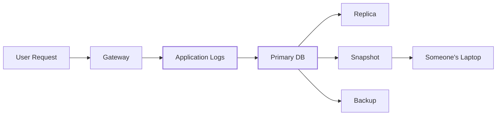
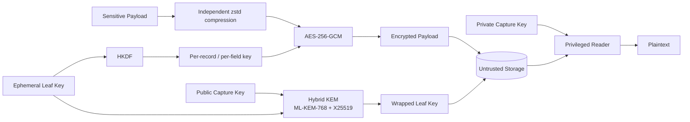
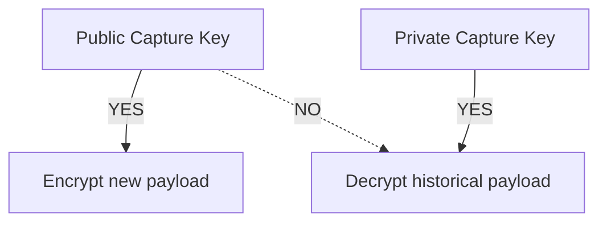

# scuttle

```text
$ cat scuttle

 ███████╗ ██████╗██╗   ██╗████████╗████████╗██╗     ███████╗
 ██╔════╝██╔════╝██║   ██║╚══██╔══╝╚══██╔══╝██║     ██╔════╝
 ███████╗██║     ██║   ██║   ██║      ██║   ██║     █████╗
 ╚════██║██║     ██║   ██║   ██║      ██║   ██║     ██╔══╝
 ███████║╚██████╗╚██████╔╝   ██║      ██║   ███████╗███████╗
 ╚══════╝ ╚═════╝ ╚═════╝    ╚═╝      ╚═╝   ╚══════╝╚══════╝

 petit chiffrement hybride post-quantique pour les données sensibles.

 > sceller partout.
 > ouvrir ailleurs.
 > volez la base de données, obtenez du texte chiffré.
 >
 > ESSAYEZ DE LE CASSER.
```

[](https://go.dev/)
[](LICENSE)
[](#la-construction-cryptographique)
[](#la-construction-cryptographique)
[](#statut)

<p align="center">
  <a href="README.md">English</a> ·
  <a href="README.zh-CN.md">简体中文</a> ·
  <a href="README.ja.md">日本語</a> ·
  <a href="README.ko.md">한국어</a> ·
  <a href="README.de.md">Deutsch</a> ·
  <b>Français</b> ·
  <a href="README.es.md">Español</a>
</p>


`scuttle` est une couche de chiffrement open source pour les journaux applicatifs sensibles.

Il est conçu pour les systèmes où les charges utiles des requêtes et des réponses
doivent être temporairement observables, mais dont des copies peuvent survivre des
années dans des bases de données, des réplicas, des instantanés et des sauvegardes.

La flotte applicative ordinaire ne reçoit **qu'une clé de capture publique**. Elle
peut chiffrer de nouveaux journaux, mais ne peut pas utiliser cette clé pour
déchiffrer les anciens.

Le matériel de clé à longue durée de vie est protégé par une **construction hybride
post-quantique utilisant ML-KEM-768 + X25519**, tandis que les charges utiles sont
chiffrées avec **AES-256-GCM** à l'aide de clés de champ dérivées indépendamment.

> **scuttle est la couche de chiffrement hybride post-quantique des charges utiles
> de journaux sensibles chez [OrcaRouter](https://www.orcarouter.ai/).**
>
> La bibliothèque open source est publiée afin que la construction puisse être
> inspectée, fuzzée, attaquée et améliorée publiquement.

---

## Cassez-le.

**Nous voulons que des gens l'attaquent.**

La cryptographie se renforce lorsque ses hypothèses sont explicites et que l'on
incite les gens à trouver où elles échouent.

[`ATTACK.md`](ATTACK.md) liste les propriétés de sécurité que nous pensons que le
système fournit, classées selon ce qu'il nous en coûterait de nous tromper, ainsi
que des cibles de fuzzing visant ces hypothèses.

Vous avez trouvé quelque chose ?

→ Lisez [`SECURITY.md`](SECURITY.md)  
→ Reproduisez-le  
→ Cassez un invariant  
→ Dites-nous où nous nous sommes trompés

## Statut

> **v0 — pas encore audité de manière indépendante.**
>
> Le format binaire n'est pas stable. Ne l'utilisez pas encore pour des données que
> vous ne pouvez pas vous permettre de perdre ou de rendre définitivement illisibles.

---

# Pourquoi « scuttle » ?

**Saborder** (*to scuttle*) un navire, c'est le rendre délibérément inutilisable
avant qu'un adversaire ne puisse s'en emparer.

Scuttle applique la même idée aux données sensibles.

```text
             attacker captures storage

                       │
                       ▼

              ┌─────────────────┐
              │    DATABASE     │
              │                 │
              │  █ ciphertext   │
              │  █ wrapped keys │
              │  █ metadata     │
              └────────┬────────┘
                       │
                       │  no capture private key
                       ▼

                 ┌───────────┐
                 │ ¯\_(ツ)_/¯ │
                 └───────────┘

               got the database.
                 not the data.
```

---

# Le problème

L'infrastructure d'IA produit des journaux d'une sensibilité inhabituelle.

Une seule requête peut contenir :

- des prompts
- des réponses de modèles
- du code source
- des sorties d'API
- des documents récupérés
- des données personnelles (PII)
- des identifiants inclus par accident dans le contexte
- des appels d'outils d'agents
- des données propriétaires d'entreprise

Une architecture de journalisation classique finit par ressembler à ceci :



Supprimer une ligne au bout de 30 jours ne supprime pas forcément la sauvegarde
d'hier, une entrée d'oplog, un réplica en retard ou un vieil instantané.

Un chiffrement uniquement au niveau du stockage signifie aussi que quiconque obtient
le chemin de déchiffrement normal de la base de données peut obtenir le texte clair.

`scuttle` déplace le chiffrement **avant le stockage**.

---

# L'architecture



La frontière importante est la suivante :

```text
┌──────────────────────── ORCAROUTER DATA PLANE ────────────────────────┐
│                                                                       │
│  API Gateway      Workers       Relays       Logging Infrastructure   │
│      │               │             │                  │               │
│      └───────────────┴─────────────┴──────────────────┘               │
│                              │                                        │
│                    PUBLIC CAPTURE KEY ONLY                            │
│                              │                                        │
│                        can encrypt                                    │
│                     cannot open history                               │
│                                                                       │
└──────────────────────────────┬────────────────────────────────────────┘
                               │
                               ▼
                    ┌─────────────────────┐
                    │  UNTRUSTED STORAGE  │
                    │                     │
                    │  encrypted payload  │
                    │  wrapped leaf key   │
                    │  metadata           │
                    └──────────┬──────────┘
                               │
                  separate trust boundary
                               │
                               ▼
                    ┌─────────────────────┐
                    │ PRIVILEGED READER   │
                    │                     │
                    │ capture private key │
                    │ access controls     │
                    │ audit boundary      │
                    └─────────────────────┘
```

Un identifiant de base de données n'est donc pas censé être un identifiant
permettant de déchiffrer l'historique des prompts.

---

# La construction cryptographique

scuttle ne remplace **pas** chaque primitive par une primitive post-quantique.

Il place la cryptographie post-quantique là où la menace quantique à long terme
compte réellement.

```text
                         SCUTTLE

 Payload
    │
    ▼
┌──────────────┐
│     zstd     │       compress independently
└──────┬───────┘
       │
       ▼
┌──────────────┐
│ AES-256-GCM  │ ◀──── HKDF-derived field key
└──────┬───────┘
       │
       ▼
  Ciphertext
       │
       │ stored together with
       ▼
┌──────────────────────────────┐
│ Wrapped Leaf Key             │
│                              │
│ ML-KEM-768  ─┐               │
│              ├─ Hybrid KEM   │
│ X25519 ──────┘               │
│                              │
│        X-Wing construction   │
└──────────────────────────────┘
```

## Pourquoi AES-256 ?

Le chiffrement des charges utiles utilise **AES-256-GCM**.

Un futur ordinateur quantique cryptographiquement pertinent modifierait l'analyse
de sécurité de la cryptographie symétrique différemment de celle de la
cryptographie à clé publique. L'algorithme de Grover apporte une accélération
quadratique générique de la recherche, et non le type de cassage que l'algorithme
de Shor provoque pour les systèmes classiques à clé publique largement déployés.

Utiliser une clé symétrique de 256 bits offre donc une marge de sécurité
substantielle pour des données chiffrées à longue durée de vie.

Il n'y a aucune raison d'appliquer ML-KEM à chaque octet d'un prompt.

Utilisez la cryptographie symétrique pour les données.

Utilisez la cryptographie post-quantique pour protéger les clés.

---

## Pourquoi ML-KEM-768 ?

Le risque à long terme se situe à la frontière de l'encapsulation de clés.

Un attaquant peut copier du trafic chiffré ou des sauvegardes **aujourd'hui**, les
conserver et tenter de les déchiffrer plus tard si la cryptographie qui protège
leurs clés devient cassable.

C'est la menace « **récolter maintenant, déchiffrer plus tard** »
(*harvest-now, decrypt-later*).

```text
2026                                      FUTURE

capture encrypted logs
        │
        ▼
██████████████████████████████████████████████►
        │                                      │
        │ keep ciphertext                      │
        │                                      ▼
        │                              cryptographically
        │                              relevant quantum
        │                              computers?
        │                                      │
        └──────────────────────────────────────┘
                         try to decrypt history
```

scuttle encapsule donc les clés feuilles avec **ML-KEM-768**, un mécanisme
d'encapsulation de clés post-quantique.

---

## Pourquoi l'hybride ML-KEM-768 + X25519 ?

Parce que remplacer une primitive éprouvée par une primitive plus récente crée un
autre type de risque.

scuttle combine :

```text
        ML-KEM-768
             │
             ├──────► HYBRID SECRET
             │
          X25519
```

au moyen de la construction hybride **X-Wing**.

L'objectif est la défense en profondeur :

| Composant | Rôle |
|---|---|
| **ML-KEM-768** | Protection contre les futures attaques quantiques |
| **X25519** | Sécurité éprouvée des courbes elliptiques classiques |
| **Construction hybride** | Ne dépendre exclusivement d'aucune des deux hypothèses |
| **AES-256-GCM** | Chiffrement authentifié des charges utiles |
| **HKDF** | Dérivation des clés de champ avec séparation de domaine |
| **AAD** | Lie cryptographiquement le texte chiffré à son contexte |

C'est pourquoi scuttle se décrit comme un **chiffrement hybride post-quantique**,
plutôt que de simplement remplacer X25519 par ML-KEM.

---

# Qu'est-ce qui est chiffré exactement ?

Chaque champ sensible est chiffré indépendamment.

Pour un enregistrement conceptuel :

```json
{
  "request_id": "req_01JQ8F7YKX2M",
  "model": "example/model",
  "status": 200,

  "request_body":  "<encrypted>",
  "response_body": "<encrypted>"
}
```

scuttle dérive une clé AES-256 distincte pour chacun :

```text
(leaf, record, request_body)
            │
            └── HKDF ──► AES key A

(leaf, record, response_body)
            │
            └── HKDF ──► AES key B
```

Les clés de contenu sont **dérivées, pas stockées**.

Une clé de champ divulguée ne devient donc pas une clé universelle de
déchiffrement de la base de données.

---

# Le texte chiffré appartient à son contexte

La base de données est considérée comme non fiable.

Les données associées d'AES-GCM lient un texte chiffré à :

```text
schema version
      +
epoch
      +
leaf
      +
tenant / workspace
      +
user
      +
record ID
      +
field name
```

Ces valeurs sont encodées sans ambiguïté avant l'authentification.

Cela signifie qu'un attaquant ne devrait pas pouvoir prendre :

```text
Tenant A
Request 123
response_body
```

et transplanter son texte chiffré dans :

```text
Tenant B
Request 456
request_body
```

tout en le faisant s'authentifier avec succès.

La base de données stocke le texte chiffré.

Elle n'a pas le droit de redéfinir ce que ce texte chiffré signifie.

---

# Authentifier les lignes : `AuthKey`

La liaison empêche un attaquant de **déplacer** un texte chiffré. À elle seule, elle
ne l'empêche pas d'en **écrire un nouveau**.

La clé de capture est publique par conception. Quiconque peut écrire dans votre
stockage peut donc fabriquer sa propre feuille, sceller n'importe quel texte sous la
liaison de n'importe quel locataire, et l'insérer. Sans clé d'authentification,
cette ligne s'ouvre proprement et ressemble exactement à un journal authentique —
ce qui compte si quoi que ce soit en aval (un outil de support, une tâche
d'analyse, un LLM qui lit ses propres journaux) fait confiance à ce qu'il lit.

`Envelope.AuthKey` comble cette lacune :

```go
env := scuttle.Envelope{
    MaxPlaintext: 256 << 10,
    AuthKey:      authKey, // 32 secret bytes, writers + readers, never stored with data
}
```

Avec une `AuthKey`, la clé par champ devient
`HKDF(salt = AuthKey, ikm = leaf key, info = binding)`. Un faussaire choisit sa
propre clé feuille mais ne connaît pas l'`AuthKey` ; il ne peut donc pas dériver la
clé de champ ni produire une étiquette que le lecteur accepte.

Ce qu'elle apporte et ce qu'elle n'apporte pas :

| | Sans `AuthKey` | Avec `AuthKey` |
|---|---|---|
| Lire un dump volé | ❌ non | ❌ non |
| Déplacer un texte chiffré vers un autre locataire / enregistrement / champ | ❌ échoue | ❌ échoue |
| Un rédacteur du stockage **insère une nouvelle ligne** | ⚠️ **s'ouvre comme authentique** | ❌ échoue |
| Un rédacteur compromis insère une ligne | ⚠️ oui | ⚠️ oui — il détient la clé ; il pourrait de toute façon écrire de faux journaux |
| Un rédacteur du stockage **supprime** ou **retient** une ligne | ⚠️ oui | ⚠️ oui — le chiffrement ne peut pas empêcher la suppression |

L'activer est une **bascule**. Un lecteur doté d'une `AuthKey` refuse les lignes
scellées sans elle ; sinon un faussaire écrirait simplement des lignes non
authentifiées. Procédez dans cet ordre :

1. Donnez l'`AuthKey` à chaque rédacteur, afin que les nouvelles lignes soient
   authentifiées.
2. Rescellez une fois chaque ligne existante avec `scuttle.Reseal`, de
   l'`Envelope` non authentifiée vers l'enveloppe authentifiée. L'opération
   conserve la feuille et la liaison de la ligne, et s'exécute côté lecteur, qui
   détient les clés feuilles.
3. À partir de là, lisez **uniquement** avec l'`Envelope` authentifiée.

**Ne choisissez jamais l'enveloppe ligne par ligne à partir d'une valeur stockée**,
comme `Binding.SchemaVersion`. Le faussaire écrit aussi cette valeur, la règle sur
« ancienne », et le lecteur ouvre la contrefaçon avec l'enveloppe non authentifiée.

**Tant que la migration de l'étape 2 n'est pas terminée, la falsification reste
possible.** La migration ne peut pas distinguer une ancienne ligne falsifiée d'une
vraie — elle rescelle tout ce qui s'ouvre —, si bien qu'une contrefaçon insérée à
n'importe quel moment avant la fin en ressort authentifiée. Par conséquent :

- Laissez les lecteurs sur l'enveloppe non authentifiée jusqu'à la fin de la
  migration ; d'ici là, les lignes écrites après l'étape 1 se lisent comme
  `ErrUndecryptable`. **Ne laissez jamais un lecteur essayer une enveloppe puis
  se rabattre sur l'autre** : c'est précisément le chemin de la falsification.
- Exécutez la migration une seule fois, puis basculez tous les lecteurs. La
  relancer plus tard rouvre la fenêtre.

La bascule arrête les nouvelles falsifications ; elle ne peut pas certifier les
lignes qu'elle a rescellées. La rotation de l'`AuthKey` suit la même procédure,
en rescellant de l'ancienne clé vers la nouvelle.

L'`AuthKey` est symétrique et fait 256 bits ; elle n'ajoute donc aucune exposition
quantique.

---

# Capture en écriture seule

C'est l'une des propriétés les plus importantes de la conception.

Le rédacteur ordinaire reçoit :

```text
PUBLIC CAPTURE KEY
```

et non :

```text
DATABASE MASTER DECRYPTION KEY
```

Ainsi :



Un relais, une passerelle ou un worker peut donc chiffrer des données sans recevoir
automatiquement la capacité de déchiffrer la base de journaux historique.

C'est pourquoi l'API sépare :

```go
LeafSealer
```

de :

```go
Keyring
```

Placer les deux côtés dans le même processus détruit cette séparation de confiance.

---

# Chaque enregistrement est autonome

Chaque enregistrement stocké transporte sa propre clé feuille encapsulée.

```text
┌────────────────────────────────────────┐
│ Stored Record                          │
│                                        │
│ metadata                               │
│ encrypted request                      │
│ encrypted response                     │
│ wrapped leaf key                       │
│ capture-key generation                 │
└────────────────────────────────────────┘
```

Il n'existe aucune base de distribution de clés en mémoire qui devrait survivre aux
côtés de l'application.

Les lecteurs détenant la clé privée de capture appropriée peuvent récupérer la clé
feuille après :

- des redémarrages de processus
- des déploiements
- des changements de réplica
- une bascule (failover)
- un remplacement de machine

---

# Rotation des clés

Les clés de capture tiennent compte des générations.

```text
Generation 3      ACTIVE
Generation 2      decrypt only
Generation 1      decrypt only
```

La rotation devient :

```go
// seeds[0] is ACTIVE — what NewLeaf seals under.
// Remaining seeds only open historical records.

keyring, err := scuttle.NewLocalKeyringMulti(
    [][]byte{newSeed, oldSeed},
)
```

Les nouveaux enregistrements utilisent la clé de capture la plus récente.

Les anciens enregistrements restent lisibles tant que la clé retirée correspondante
reste dans le trousseau.

Une fois que la politique de rétention a éliminé tout ce que protège une ancienne
génération, cette génération peut être retirée.

Les graines en double sont rejetées plutôt que de prétendre silencieusement qu'une
rotation a eu lieu.

Les lignes écrites avant que les enregistrements ne portent un marqueur de
génération (`KemKeyID` vide) sont essayées contre chaque génération du trousseau,
la génération active en premier. C'est sûr, car l'ouverture HPKE est authentifiée :
une mauvaise génération échoue sur son étiquette au lieu de produire une mauvaise clé.

---

# La compression précède le chiffrement

```text
plaintext
   │
   ▼
 zstd
   │
   ▼
AES-256-GCM
   │
   ▼
ciphertext
```

Les données chiffrées sont en pratique incompressibles.

Compresser d'abord évite de ruiner l'efficacité de la compression du moteur de
stockage.

Chaque champ est compressé indépendamment : les données d'un locataire ne partagent
donc jamais un contexte de compression avec celles d'un autre locataire.

**À l'intérieur d'un même champ, en revanche, il y a une fuite.** La longueur
compressée dépend du caractère répétitif du texte clair. Si un champ contient un
secret à côté d'un texte qu'un attaquant peut influencer — un prompt système ou un
identifiant à côté de contenu utilisateur ou récupéré, un en-tête `Authorization` à
côté d'en-têtes choisis par le client —, un attaquant capable de lire la longueur
des textes chiffrés stockés peut tester des hypothèses sur le secret, une requête à
la fois. C'est l'attaque CRIME.

Pour ces champs, activez `Envelope.DisableCompression`. Le champ est alors stocké
sans compression (toujours sous forme de trame zstd, les lecteurs n'ont donc rien à
changer), et sa longueur ne révèle que celle du texte clair. Le coût est le stockage.

---

# Utilisation

```bash
go get github.com/Continuum-AI-Corp/scuttle
go install github.com/Continuum-AI-Corp/scuttle/cmd/scuttle-keygen@latest  # prints a fresh key set
```

```go
// ─────────────────────────────────────────────────────────────
// WRITER
//
// Holds a PUBLIC capture key.
// Can seal new data.
// Cannot use that key to open historical data.
// ─────────────────────────────────────────────────────────────

capturePublicKey, err := scuttle.ParsePublicKey(os.Getenv("SCUTTLE_CAPTURE_PUBLIC_KEY"))
if err != nil {
    return err // unset or malformed: refuse to start
}
authKey, err := scuttle.ParseAuthKey(os.Getenv("SCUTTLE_AUTH_KEY"))
if err != nil {
    return err // never fall back to sealing unauthenticated rows
}

sealer, err := scuttle.NewLeafSealer(capturePublicKey)
if err != nil {
    return err
}

leafKey, sealed, err := sealer.NewLeaf("tenant:42|user:7|2026-09-12T10")
if err != nil {
    return err
}
// Keep leafKey in memory only for the chosen lifetime.
// Store sealed.LeafID, sealed.KemKeyID and sealed.Blob with the record.

// Writers and readers must use the same Envelope configuration.
env := scuttle.Envelope{
    MaxPlaintext: 256 << 10,
    AuthKey:      authKey,
}

bind := scuttle.Binding{
    SchemaVersion: 1,
    LeafID:        sealed.LeafID,
    WorkspaceID:   42,
    UserID:        7,
    RequestID:     "req_01JQ8F7YKX2M", // unique per stored record
}

// ErrPlaintextTooLarge: the body is over MaxPlaintext. Nothing was written.
ct, err := env.Seal(leafKey, bind, scuttle.FieldRequestBody, payload)
if err != nil {
    return err
}
```

L'ouverture se fait du côté privilégié :

```go
// ─────────────────────────────────────────────────────────────
// READER
//
// Privileged.
// Keep this trust boundary away from ordinary writers.
// ─────────────────────────────────────────────────────────────

seed, err := scuttle.ParseCaptureSeed(os.Getenv("SCUTTLE_CAPTURE_SEED"))
if err != nil {
    return err // an unset seed must stop the reader, not start it
}
keyring, err := scuttle.NewLocalKeyring(seed)
if err != nil {
    return err
}
authKey, err := scuttle.ParseAuthKey(os.Getenv("SCUTTLE_AUTH_KEY"))
if err != nil {
    return err
}
env := scuttle.Envelope{MaxPlaintext: 256 << 10, AuthKey: authKey}

key, err := keyring.OpenLeaf(ctx, sealed)
switch {
case errors.Is(err, scuttle.ErrKeyUnavailable):
    return err // retryable: a remote keyring is unreachable, or ctx ended
case err != nil:
    return err // ErrUndecryptable: NOT retryable; investigate
}
defer clear(key) // zero the leaf key when done

plaintext, err := env.Open(key, bind, scuttle.FieldRequestBody, ct)
if err != nil {
    return err // ErrUndecryptable: tampered, forged, or bound elsewhere
}
```

---

# La sémantique des erreurs compte

Ces deux erreurs signifient délibérément des choses différentes.

### `ErrKeyUnavailable`

L'infrastructure de déchiffrement ne peut pas fournir la clé requise pour le moment.

**Potentiellement réessayable.**

### `ErrUndecryptable`

L'enregistrement ne peut pas être déchiffré tel qu'il se présente.

**Ce n'est pas une condition normale de nouvelle tentative. Enquêtez.**

Confondre les deux transforme des pannes d'infrastructure en corruption apparente —
ou, pire, transforme de véritables défauts cryptographiques en tentatives infinies.

Une ligne sans aucune feuille scellée relève de `ErrUndecryptable` : chaque
enregistrement porte la sienne, donc attendre n'en fera pas apparaître une.

Deux autres erreurs décrivent **votre code**, pas une ligne :

- **`ErrPlaintextTooLarge`** — `Seal` a reçu un corps dépassant le plafond de
  l'enveloppe. Rien n'a été écrit.
- **`ErrInvalidConfig`** — une `AuthKey` de mauvaise taille ou entièrement nulle, un
  `MaxPlaintext` supérieur à `MaxPlaintextCeiling` (16 MiB), ou une chaîne de clé mal
  formée. Corrigez le déploiement.

Une version complète et exécutable de cette section se trouve dans
[`example_test.go`](example_test.go).

---

# Modèle de menace

scuttle est conçu pour améliorer l'issue de scénarios tels que :

| Événement | Résultat visé |
|---|---|
| Identifiant de base de données volé | La charge utile reste chiffrée |
| Dump de base de données volé | La charge utile reste chiffrée |
| Sauvegarde divulguée | La charge utile reste chiffrée |
| Instantané exposé | La charge utile reste chiffrée |
| Un administrateur du stockage lit la base | Aucun texte clair de charge utile à partir du seul stockage |
| Rédacteur compromis | Base historique non déchiffrable automatiquement à partir de la clé publique de capture |
| Texte chiffré déplacé entre locataires | L'authentification échoue |
| Texte chiffré existant modifié | L'authentification échoue |
| Un rédacteur du stockage insère une **nouvelle ligne falsifiée** | Échoue **uniquement avec `Envelope.AuthKey`**, lue comme décrit dans *Authentifier les lignes* ; sans elle, la ligne s'ouvre comme authentique |
| Un attaquant lit la longueur des textes chiffrés d'un champ mêlant un secret à son propre texte | Des hypothèses peuvent être testées, **sauf si `Envelope.DisableCompression`** est activé |
| Future attaque quantique contre l'échange de clés classique | La couche ML-KEM fournit une protection post-quantique |

La dernière ligne est la raison d'être de la couche post-quantique.

---

# Ce que scuttle **ne protège pas**

Les affirmations de sécurité sont plus utiles lorsque leurs limites sont explicites.

### Il n'efface pas les données

Détruire les clés de chiffrement pour que le texte chiffré historique devienne
définitivement illisible — l'**effacement cryptographique** — est un problème distinct.

### Il ne masque pas les métadonnées

Les informations nécessaires aux requêtes peuvent rester visibles, notamment :

- les horodatages
- la taille des charges utiles
- les noms de modèles
- les codes de statut
- les identifiants

Un attaquant ayant accès à la base de données peut encore apprendre des métadonnées
de trafic importantes.

### Il ne protège pas le texte clair dans la mémoire du processus

L'application voit nécessairement le texte clair pendant qu'elle le traite.

Un processus compromis, un vidage mémoire, un débogueur ou une instrumentation
d'exécution suffisamment privilégiée peut voir ce texte clair.

### Il ne met pas en échec un lecteur autorisé

Si une identité est légitimement autorisée à demander le texte clair, c'est au
contrôle d'accès qu'il revient de décider si cette demande est permise.

scuttle protège le matériel cryptographique.

Ce n'est pas un système d'autorisation.

### Un Keyring dans le même processus n'est pas en écriture seule

Si le processus rédacteur détient aussi la clé privée de capture, compromettre ce
processus livre tous les enregistrements historiques, et pas seulement sa fenêtre
de feuille courante. La propriété d'écriture seule n'existe que lorsque la graine de
capture réside là où les rédacteurs ne sont pas : un service de lecture séparé, ou un
KMS / HSM derrière votre propre implémentation de l'interface `Keyring`.

### Il n'offre pas de confidentialité persistante

La graine de capture est un secret racine unique à longue durée de vie. Quiconque
l'obtient — aujourd'hui ou en 2040 — peut ouvrir tous les enregistrements encore
existants scellés sous sa clé publique. L'encapsulation post-quantique protège contre
quelqu'un qui ne possède **pas** la graine ; elle ne fait rien contre quelqu'un qui la
possède. Conservez la graine dans un KMS ou un HSM, confiez-la au moins de processus
possible, effectuez-en la rotation et laissez la rétention supprimer ce que les
anciennes générations protégeaient.

### Il n'authentifie pas les lignes par défaut

Sans `Envelope.AuthKey`, quiconque peut écrire dans le stockage peut insérer une ligne
qui se déchiffre comme authentique. Voir
[Authentifier les lignes](#authentifier-les-lignes--authkey).

### Il n'authentifie pas les métadonnées

Seules les valeurs de `Binding` sont liées au texte chiffré. Les autres colonnes —
nom du modèle, statut, horodatages, marque de génération — peuvent être réécrites
par quiconque dispose d'un accès en écriture, même avec une `AuthKey`. Placez dans
la liaison tout ce sur quoi vous comptez.

La liaison n'est par ailleurs pas plus précise que ses valeurs : deux
enregistrements stockés avec le même `Binding` peuvent échanger leurs blobs de champ
sans être détectés. `RequestID` doit donc être unique par enregistrement stocké ; si
une requête écrit plusieurs enregistrements (nouvelles tentatives, replis), incluez
la tentative.

### La compression fuit à l'intérieur d'un champ

Voir *La compression précède le chiffrement*. Utilisez `Envelope.DisableCompression`
pour les champs qui mêlent un secret à un texte influencé par un attaquant.

### Un rédacteur compromis peut écrire un faux historique

Un rédacteur détient l'`AuthKey` ; un attaquant qui en contrôle un peut donc écrire
des lignes sous n'importe quelle liaison — y compris des liaisons passées — tant que
cette clé est en usage. Faites tourner l'`AuthKey` après la compromission d'un
rédacteur.

### Il n'empêche ni la suppression ni le retour en arrière

Un attaquant disposant d'un accès en écriture peut supprimer des lignes ou les
retenir. Le chiffrement ne peut pas détecter une ligne qui n'est pas là.

### Il n'est pas audité

scuttle est en **v0 et n'a pas été audité de manière indépendante**. Il a fait
l'objet de revues internes, consignées dans [`CHANGELOG.md`](CHANGELOG.md), qui n'en
tiennent pas lieu. Les primitives proviennent toutes de la bibliothèque standard de
Go (`crypto/hpke`, `crypto/hkdf`, AES-GCM), mais la manière dont elles sont
combinées est la nôtre. [`SPEC.md`](SPEC.md) décrit le format avec
précision, et [`ATTACK.md`](ATTACK.md) liste les affirmations qui valent la peine
d'être cassées.

---

# Pour aller plus loin

- [`SPEC.md`](SPEC.md) — le format binaire, octet par octet, avec des vecteurs de test
  dans [`testdata/vectors.json`](testdata/vectors.json).
- [`ATTACK.md`](ATTACK.md) — les affirmations, et les cibles de fuzzing qui les visent.
- [`SECURITY.md`](SECURITY.md) — comment signaler une découverte.
- [`CHANGELOG.md`](CHANGELOG.md) — ce qui a changé, y compris les changements de format.
- [`CONTRIBUTING.md`](CONTRIBUTING.md) — comment y contribuer.

Distribué sous la [licence Apache 2.0](LICENSE).
