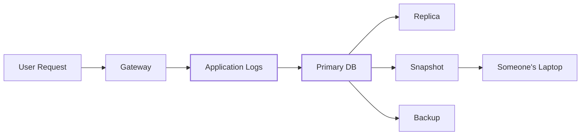
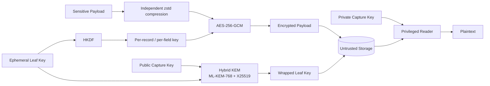
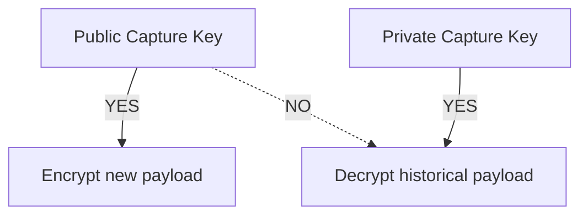

# scuttle

```text
$ cat scuttle

 ███████╗ ██████╗██╗   ██╗████████╗████████╗██╗     ███████╗
 ██╔════╝██╔════╝██║   ██║╚══██╔══╝╚══██╔══╝██║     ██╔════╝
 ███████╗██║     ██║   ██║   ██║      ██║   ██║     █████╗
 ╚════██║██║     ██║   ██║   ██║      ██║   ██║     ██╔══╝
 ███████║╚██████╗╚██████╔╝   ██║      ██║   ███████╗███████╗
 ╚══════╝ ╚═════╝ ╚═════╝    ╚═╝      ╚═╝   ╚══════╝╚══════╝

 機密データのための小さなハイブリッド耐量子暗号。

 > どこでも seal。
 > open は別の場所で。
 > データベースを盗んでも、手に入るのは暗号文。
 >
 > どうか壊してみてください。
```

[](https://go.dev/)
[](LICENSE)
[](#暗号構成)
[](#暗号構成)
[](#ステータス)

<p align="center">
  <a href="README.md">English</a> ·
  <a href="README.zh-CN.md">简体中文</a> ·
  <b>日本語</b> ·
  <a href="README.ko.md">한국어</a> ·
  <a href="README.de.md">Deutsch</a> ·
  <a href="README.fr.md">Français</a> ·
  <a href="README.es.md">Español</a>
</p>


`scuttle` は、機密性の高いアプリケーションログのためのオープンソース暗号化レイヤーです。

リクエストとレスポンスのペイロードを一時的に観測できる必要がある一方で、
そのコピーがデータベース、レプリカ、スナップショット、バックアップの中に
何年も残り続けるかもしれないシステムのために設計されています。

通常のアプリケーション群が受け取るのは **公開キャプチャ鍵だけ** です。
新しいログを暗号化することはできますが、その鍵で過去のログを復号することはできません。

長期間使われる鍵素材は **ML-KEM-768 + X25519 によるハイブリッド耐量子構成** で保護され、
ペイロードは独立に導出されたフィールド鍵を使って **AES-256-GCM** で暗号化されます。

> **scuttle は [OrcaRouter](https://www.orcarouter.ai/) における、機密性の高いログペイロードのための
> ハイブリッド耐量子暗号化レイヤーです。**
>
> このオープンソースライブラリは、構成を公開の場で検査し、ファジングし、
> 攻撃し、改善できるようにするために公開されています。

---

## 壊してみてください。

**私たちは、これを攻撃してほしいと考えています。**

暗号は、その前提が明示され、前提が崩れる箇所を見つけることに
インセンティブが与えられているときに、より強くなります。

[`ATTACK.md`](ATTACK.md) には、このシステムが提供すると私たちが考えるセキュリティ特性を、
それが間違っていた場合の代償の大きい順に並べ、それらの前提を狙ったファズターゲットと
あわせて掲載しています。

何か見つけましたか？

→ [`SECURITY.md`](SECURITY.md) を読む  
→ 再現する  
→ 不変条件を破る  
→ 私たちの誤りを教えてください

## ステータス

> **v0 — 独立した監査は受けていません。**
>
> ワイヤフォーマットは安定していません。失うわけにいかないデータや、
> 永久に読めなくなっては困るデータには、まだ使わないでください。

---

# なぜ「scuttle」なのか？

船を **scuttle（自沈）** させるとは、敵に拿捕される前に、
意図的にその船を使えなくすることです。

scuttle は同じ考え方を機密データに適用します。

```text
             attacker captures storage

                       │
                       ▼

              ┌─────────────────┐
              │    DATABASE     │
              │                 │
              │  █ ciphertext   │
              │  █ wrapped keys │
              │  █ metadata     │
              └────────┬────────┘
                       │
                       │  no capture private key
                       ▼

                 ┌───────────┐
                 │ ¯\_(ツ)_/¯ │
                 └───────────┘

               got the database.
                 not the data.
```

---

# 問題

AI インフラは、並外れて機密性の高いログを生み出します。

1 つのリクエストには次のようなものが含まれ得ます。

- プロンプト
- モデルの応答
- ソースコード
- API の出力
- 検索で取得したドキュメント
- 個人情報（PII）
- コンテキストに誤って含まれた認証情報
- エージェントのツール呼び出し
- 企業の機密データ

一般的なロギングのアーキテクチャは、いずれ次のような姿になります。



30 日後に行を削除しても、昨日のバックアップ、oplog のエントリ、
遅延しているレプリカ、古いスナップショットまで削除されるとは限りません。

また、ストレージ層だけで暗号化している場合、データベースの通常の復号経路を
手に入れた者は誰でも平文を手に入れられる可能性があります。

`scuttle` は暗号化を **保存の前** に移します。

---

# アーキテクチャ



重要な境界は次のとおりです。

```text
┌──────────────────────── ORCAROUTER DATA PLANE ────────────────────────┐
│                                                                       │
│  API Gateway      Workers       Relays       Logging Infrastructure   │
│      │               │             │                  │               │
│      └───────────────┴─────────────┴──────────────────┘               │
│                              │                                        │
│                    PUBLIC CAPTURE KEY ONLY                            │
│                              │                                        │
│                        can encrypt                                    │
│                     cannot open history                               │
│                                                                       │
└──────────────────────────────┬────────────────────────────────────────┘
                               │
                               ▼
                    ┌─────────────────────┐
                    │  UNTRUSTED STORAGE  │
                    │                     │
                    │  encrypted payload  │
                    │  wrapped leaf key   │
                    │  metadata           │
                    └──────────┬──────────┘
                               │
                  separate trust boundary
                               │
                               ▼
                    ┌─────────────────────┐
                    │ PRIVILEGED READER   │
                    │                     │
                    │ capture private key │
                    │ access controls     │
                    │ audit boundary      │
                    └─────────────────────┘
```

したがって、データベースの認証情報が、過去のプロンプトを復号するための
認証情報になることは想定されていません。

---

# 暗号構成

scuttle は、すべてのプリミティブを耐量子プリミティブに置き換えるわけでは **ありません**。

長期的な量子の脅威が実際に問題になる箇所に、耐量子暗号を配置します。

```text
                         SCUTTLE

 Payload
    │
    ▼
┌──────────────┐
│     zstd     │       compress independently
└──────┬───────┘
       │
       ▼
┌──────────────┐
│ AES-256-GCM  │ ◀──── HKDF-derived field key
└──────┬───────┘
       │
       ▼
  Ciphertext
       │
       │ stored together with
       ▼
┌──────────────────────────────┐
│ Wrapped Leaf Key             │
│                              │
│ ML-KEM-768  ─┐               │
│              ├─ Hybrid KEM   │
│ X25519 ──────┘               │
│                              │
│        X-Wing construction   │
└──────────────────────────────┘
```

## なぜ AES-256 なのか？

ペイロードの暗号化には **AES-256-GCM** を使います。

将来、暗号学的に意味のある量子コンピュータが登場した場合、共通鍵暗号の
安全性評価は、公開鍵暗号とは異なる形で変わります。
Grover のアルゴリズムがもたらすのは汎用的な二乗の探索高速化であり、
Shor のアルゴリズムが広く普及した古典的公開鍵方式にもたらすような破綻ではありません。

そのため、256 ビットの共通鍵を使えば、長期間保存される暗号化データに対して
十分な安全マージンが得られます。

プロンプトの全バイトに ML-KEM をかける理由はありません。

データには共通鍵暗号を使います。

鍵の保護には耐量子暗号を使います。

---

## なぜ ML-KEM-768 なのか？

長期的なリスクは鍵カプセル化の境界にあります。

攻撃者は暗号化された通信やバックアップを **今日** コピーして保持しておき、
それらの鍵を保護している暗号が将来破れるようになったときに復号を試みることができます。

これが **harvest-now, decrypt-later（今収集し、後で復号する）** という脅威です。

```text
2026                                      FUTURE

capture encrypted logs
        │
        ▼
██████████████████████████████████████████████►
        │                                      │
        │ keep ciphertext                      │
        │                                      ▼
        │                              cryptographically
        │                              relevant quantum
        │                              computers?
        │                                      │
        └──────────────────────────────────────┘
                         try to decrypt history
```

そのため scuttle は、耐量子の鍵カプセル化メカニズムである **ML-KEM-768** を使って
リーフ鍵をラップします。

---

## なぜ ML-KEM-768 + X25519 のハイブリッドなのか？

成熟したプリミティブを新しいプリミティブで置き換えることは、別の種類のリスクを生むからです。

scuttle は次の 2 つを

```text
        ML-KEM-768
             │
             ├──────► HYBRID SECRET
             │
          X25519
```

ハイブリッドな **X-Wing** 構成によって組み合わせます。

目的は多層防御です。

| コンポーネント | 目的 |
|---|---|
| **ML-KEM-768** | 将来の量子攻撃からの保護 |
| **X25519** | 成熟した古典的楕円曲線による安全性 |
| **ハイブリッド構成** | どちらか一方の前提だけに依存しない |
| **AES-256-GCM** | 認証付きのペイロード暗号化 |
| **HKDF** | ドメイン分離されたフィールド鍵の導出 |
| **AAD** | 暗号文をそのコンテキストに暗号学的に結び付ける |

これが、scuttle が単に X25519 を ML-KEM に置き換えるのではなく、
自らを **ハイブリッド耐量子暗号** と称する理由です。

---

# 具体的に何が暗号化されるのか？

機密性のある各フィールドは、それぞれ独立に暗号化されます。

概念的なレコードの例：

```json
{
  "request_id": "req_01JQ8F7YKX2M",
  "model": "example/model",
  "status": 200,

  "request_body":  "<encrypted>",
  "response_body": "<encrypted>"
}
```

scuttle はそれぞれに対して別々の AES-256 鍵を導出します。

```text
(leaf, record, request_body)
            │
            └── HKDF ──► AES key A

(leaf, record, response_body)
            │
            └── HKDF ──► AES key B
```

コンテンツ鍵は **導出されるものであり、保存はされません**。

したがって、フィールド鍵が 1 つ漏洩しても、それがデータベース全体を
復号できる万能鍵になることはありません。

---

# 暗号文はそのコンテキストに属する

データベースは信頼できないものとみなします。

AES-GCM の関連データ（AAD）は、暗号文を次の要素に結び付けます。

```text
schema version
      +
epoch
      +
leaf
      +
tenant / workspace
      +
user
      +
record ID
      +
field name
```

これらの値は、認証の前に曖昧さのない形でエンコードされます。

つまり、攻撃者が次の暗号文を取り出して

```text
Tenant A
Request 123
response_body
```

次の場所へ移植し、

```text
Tenant B
Request 456
request_body
```

認証を通過させることはできないはずです。

データベースは暗号文を保存します。

しかし、その暗号文が何を意味するのかを再定義することはできません。

---

# 行の認証：`AuthKey`

バインディングは、攻撃者が暗号文を **移動** させることを防ぎます。
しかしそれだけでは、攻撃者が **新しい暗号文を書き込む** ことは防げません。

キャプチャ鍵は設計上、公開されています。したがってストレージに書き込める者は誰でも、
自分でリーフを作成し、任意のテナントのバインディングで好きなテキストを seal して、
それを挿入できます。認証鍵がなければ、その行は問題なく open でき、本物のログと
まったく同じに見えます。これは、下流の何か（サポートツール、分析ジョブ、
自分自身のログを読む LLM など）が読んだ内容を信頼する場合に問題となります。

`Envelope.AuthKey` はこの穴を塞ぎます。

```go
env := scuttle.Envelope{
    MaxPlaintext: 256 << 10,
    AuthKey:      authKey, // 32 secret bytes, writers + readers, never stored with data
}
```

`AuthKey` を設定すると、フィールドごとの鍵は
`HKDF(salt = AuthKey, ikm = leaf key, info = binding)` になります。偽造者は
自分のリーフ鍵を選べますが `AuthKey` を知らないため、フィールド鍵を導出できず、
リーダーが受け入れるタグを生成することもできません。

これによって得られるもの、得られないもの：

| | `AuthKey` なし | `AuthKey` あり |
|---|---|---|
| 盗まれたダンプを読む | ❌ 不可 | ❌ 不可 |
| 暗号文を別のテナント／レコード／フィールドへ移す | ❌ 失敗 | ❌ 失敗 |
| ストレージへの書き込み者が **新しい行を仕込む** | ⚠️ **本物として open される** | ❌ 失敗 |
| 侵害された書き込み者が行を仕込む | ⚠️ 可能 | ⚠️ 可能 — 鍵を持っているので、いずれにせよ偽のログを書ける |
| ストレージへの書き込み者が行を **削除** または **隠蔽** する | ⚠️ 可能 | ⚠️ 可能 — 暗号化では削除を防げない |

有効化は **切り替え（カットオーバー）** です。`AuthKey` を持つリーダーは、
`AuthKey` なしで seal された行を拒否します。そうしなければ、偽造者は単に
認証なしの行を書くだけで済んでしまうからです。次の順序で行ってください。

1. すべての書き込み側に `AuthKey` を渡し、新しい行が認証付きになるようにします。
2. 既存のすべての行を `scuttle.Reseal` で一度だけ seal し直し、認証なしの `Envelope` から
   認証付きのものへ移します。行のリーフとバインディングはそのまま保たれ、この処理は
   リーフ鍵を保持しているリーダー側で実行します。
3. それ以降は、認証付きの `Envelope` **だけ** で読みます。

**保存された値をもとに、行ごとにエンベロープを選んではいけません。**
`Binding.SchemaVersion` のような値も同様です。偽造者はその値も書き込めるので「旧形式」に設定し、
リーダーは偽造された行を認証なしのエンベロープで open してしまいます。

**手順 2 の移行が完了するまでは、偽造はまだ可能です。** 移行処理は偽造された旧形式の行と
本物の行を区別できません。open できたものは何でも seal し直すため、完了前のどの時点で
仕込まれた偽造も、認証付きになって出てきます。したがって、

- 移行が完了するまで、リーダーは認証なしのエンベロープのままにしておきます。それまでの間、
  手順 1 以降に書き込まれた行は `ErrUndecryptable` として読まれます。**リーダーに
  一方のエンベロープを試させ、失敗したらもう一方にフォールバックさせてはいけません。**
  それこそが偽造の経路です。
- 移行は一度だけ実行し、その後すべてのリーダーを切り替えます。後から再実行すると、
  窓が再び開きます。

カットオーバーは新たな偽造を止めますが、seal し直した行の正しさを証明することはできません。
`AuthKey` のローテーションも同じ手順で、古い鍵から新しい鍵へ seal し直します。

`AuthKey` は 256 ビットの共通鍵なので、量子に対する露出は増えません。

---

# 書き込み専用のキャプチャ

これは、この設計で最も重要な特性の 1 つです。

通常の書き込み側が受け取るのは次のものです。

```text
PUBLIC CAPTURE KEY
```

次のものではありません。

```text
DATABASE MASTER DECRYPTION KEY
```

つまり：



したがって、リレー、ゲートウェイ、ワーカーは、過去のログデータベースを
復号する能力を自動的に得ることなく、データを暗号化できます。

これが、API が次のものを

```go
LeafSealer
```

次のものから分離している理由です。

```go
Keyring
```

両方を同じプロセスに置くと、この信頼の分離は崩れます。

---

# すべてのレコードは自己完結している

保存される各レコードは、それ自身のラップ済みリーフ鍵を持ちます。

```text
┌────────────────────────────────────────┐
│ Stored Record                          │
│                                        │
│ metadata                               │
│ encrypted request                      │
│ encrypted response                     │
│ wrapped leaf key                       │
│ capture-key generation                 │
└────────────────────────────────────────┘
```

アプリケーションと並行して生き残らなければならない、
インメモリの鍵配布データベースは存在しません。

適切なキャプチャ秘密鍵を持つリーダーは、次のような事象の後でもリーフ鍵を復元できます。

- プロセスの再起動
- デプロイ
- レプリカの変更
- フェイルオーバー
- マシンの交換

---

# 鍵のローテーション

キャプチャ鍵は世代（generation）を認識します。

```text
Generation 3      ACTIVE
Generation 2      decrypt only
Generation 1      decrypt only
```

ローテーションは次のようになります。

```go
// seeds[0] is ACTIVE — what NewLeaf seals under.
// Remaining seeds only open historical records.

keyring, err := scuttle.NewLocalKeyringMulti(
    [][]byte{newSeed, oldSeed},
)
```

新しいレコードは最新のキャプチャ鍵を使います。

古いレコードは、対応する退役済みの鍵がキーリングに残っている限り読み続けられます。

保持期間の経過によって、古い世代で保護されていたものがすべて消えたら、
その世代は削除できます。

重複したシードは、ローテーションが起きたかのように黙って装うのではなく、拒否されます。

レコードが世代スタンプを持つようになる前に書かれた行（`KemKeyID` が空）は、
アクティブな世代から順に、キーリング内のすべての世代で試されます。
HPKE の open は認証付きなので、これは安全です。誤った世代では、
誤った鍵を生成するのではなくタグの検証に失敗します。

---

# 圧縮は暗号化の前に行う

```text
plaintext
   │
   ▼
 zstd
   │
   ▼
AES-256-GCM
   │
   ▼
ciphertext
```

暗号化されたデータは実質的に圧縮できません。

先に圧縮することで、ストレージエンジンの圧縮効率を損なわずに済みます。

各フィールドは独立に圧縮されるため、あるテナントのデータが別のテナントのデータと
圧縮コンテキストを共有することはありません。

**ただし、1 つのフィールドの中では漏洩します。** 圧縮後の長さは、平文がどれだけ反復的かに依存します。
あるフィールドに、攻撃者が影響を与えられるテキストと並んで秘密が含まれている場合
（ユーザーのコンテンツや検索で取得したコンテンツの隣にあるシステムプロンプトや認証情報、
クライアントが選んだヘッダーの隣にある `Authorization` ヘッダーなど）、保存された暗号文の長さを
読める攻撃者は、1 リクエストずつ秘密についての推測を検証できます。これが CRIME 攻撃です。

そのようなフィールドには `Envelope.DisableCompression` を設定してください。フィールドは
圧縮されずに保存され（それでも zstd フレームとして保存されるため、リーダー側の変更は不要です）、
その長さから分かるのは平文の長さだけになります。代償はストレージ容量です。

---

# 使い方

```bash
go get github.com/Continuum-AI-Corp/scuttle
go install github.com/Continuum-AI-Corp/scuttle/cmd/scuttle-keygen@latest  # prints a fresh key set
```

```go
// ─────────────────────────────────────────────────────────────
// WRITER
//
// Holds a PUBLIC capture key.
// Can seal new data.
// Cannot use that key to open historical data.
// ─────────────────────────────────────────────────────────────

capturePublicKey, err := scuttle.ParsePublicKey(os.Getenv("SCUTTLE_CAPTURE_PUBLIC_KEY"))
if err != nil {
    return err // unset or malformed: refuse to start
}
authKey, err := scuttle.ParseAuthKey(os.Getenv("SCUTTLE_AUTH_KEY"))
if err != nil {
    return err // never fall back to sealing unauthenticated rows
}

sealer, err := scuttle.NewLeafSealer(capturePublicKey)
if err != nil {
    return err
}

leafKey, sealed, err := sealer.NewLeaf("tenant:42|user:7|2026-09-12T10")
if err != nil {
    return err
}
// Keep leafKey in memory only for the chosen lifetime.
// Store sealed.LeafID, sealed.KemKeyID and sealed.Blob with the record.

// Writers and readers must use the same Envelope configuration.
env := scuttle.Envelope{
    MaxPlaintext: 256 << 10,
    AuthKey:      authKey,
}

bind := scuttle.Binding{
    SchemaVersion: 1,
    LeafID:        sealed.LeafID,
    WorkspaceID:   42,
    UserID:        7,
    RequestID:     "req_01JQ8F7YKX2M", // unique per stored record
}

// ErrPlaintextTooLarge: the body is over MaxPlaintext. Nothing was written.
ct, err := env.Seal(leafKey, bind, scuttle.FieldRequestBody, payload)
if err != nil {
    return err
}
```

open は特権側で行います。

```go
// ─────────────────────────────────────────────────────────────
// READER
//
// Privileged.
// Keep this trust boundary away from ordinary writers.
// ─────────────────────────────────────────────────────────────

seed, err := scuttle.ParseCaptureSeed(os.Getenv("SCUTTLE_CAPTURE_SEED"))
if err != nil {
    return err // an unset seed must stop the reader, not start it
}
keyring, err := scuttle.NewLocalKeyring(seed)
if err != nil {
    return err
}
authKey, err := scuttle.ParseAuthKey(os.Getenv("SCUTTLE_AUTH_KEY"))
if err != nil {
    return err
}
env := scuttle.Envelope{MaxPlaintext: 256 << 10, AuthKey: authKey}

key, err := keyring.OpenLeaf(ctx, sealed)
switch {
case errors.Is(err, scuttle.ErrKeyUnavailable):
    return err // retryable: a remote keyring is unreachable, or ctx ended
case err != nil:
    return err // ErrUndecryptable: NOT retryable; investigate
}
defer clear(key) // zero the leaf key when done

plaintext, err := env.Open(key, bind, scuttle.FieldRequestBody, ct)
if err != nil {
    return err // ErrUndecryptable: tampered, forged, or bound elsewhere
}
```

---

# 失敗時のセマンティクスは重要

次の 2 つのエラーは、意図的に異なる意味を持っています。

### `ErrKeyUnavailable`

復号インフラが、現時点で必要な鍵を提供できません。

**再試行できる可能性があります。**

### `ErrUndecryptable`

そのレコードは、提示された状態のままでは復号できません。

**通常の再試行の対象ではありません。調査してください。**

この 2 つを混同すると、インフラの障害が見かけ上のデータ破損に変わってしまいます。
さらに悪いことに、本物の暗号上の不具合が無限の再試行に変わってしまいます。

seal されたリーフをまったく持たない行は `ErrUndecryptable` です。
すべてのレコードは自分自身のリーフを持っているため、待っても現れることはありません。

さらに 2 つのエラーは、行ではなく **あなたのコード** について述べるものです。

- **`ErrPlaintextTooLarge`** — `Seal` にエンベロープの上限を超える本文が渡されました。
  何も書き込まれていません。
- **`ErrInvalidConfig`** — サイズが誤っているかすべてゼロの `AuthKey`、
  `MaxPlaintextCeiling`（16 MiB）を超える `MaxPlaintext`、または不正な形式の鍵文字列です。
  デプロイ設定を修正してください。

このセクションの完全で実行可能なバージョンは
[`example_test.go`](example_test.go) にあります。

---

# 脅威モデル

scuttle は、次のようなシナリオの結果を改善するように設計されています。

| 事象 | 想定される結果 |
|---|---|
| データベースの認証情報が盗まれる | ペイロードは暗号化されたまま |
| データベースのダンプが盗まれる | ペイロードは暗号化されたまま |
| バックアップが漏洩する | ペイロードは暗号化されたまま |
| スナップショットが露出する | ペイロードは暗号化されたまま |
| ストレージ管理者が DB を読む | ストレージだけからはペイロードの平文は得られない |
| 書き込み側が侵害される | キャプチャ公開鍵から過去のデータベースが自動的に復号可能になることはない |
| 暗号文がテナント間で移動される | 認証に失敗する |
| 既存の暗号文が改変される | 認証に失敗する |
| ストレージへの書き込み者が **新しい偽造** 行を挿入する | **`Envelope.AuthKey` があり、*行の認証* で説明したとおりに読む場合のみ** 失敗する。ない場合、その行は本物として open される |
| 攻撃者が、秘密と自分のテキストが混在するフィールドの暗号文の長さを読む | 推測を検証できる。**`Envelope.DisableCompression` を設定していない限り** |
| 古典的な鍵交換に対する将来の量子攻撃 | ML-KEM 層が耐量子の保護を提供する |

最後の行こそが、耐量子レイヤーが存在する理由です。

---

# scuttle が保護 **しない** もの

セキュリティ上の主張は、その境界が明示されているほど役に立ちます。

### データを消去しない

暗号鍵を破棄して過去の暗号文を永久に読めなくすること、
すなわち **暗号学的消去（cryptographic erasure）** は、別の問題です。

### メタデータを隠さない

クエリに必要な情報は、見える状態のまま残ることがあります。例えば次のようなものです。

- タイムスタンプ
- ペイロードのサイズ
- モデル名
- ステータスコード
- 識別子

データベースにアクセスできる攻撃者は、それでも重要な通信メタデータを知り得ます。

### プロセスメモリ内の平文は保護しない

アプリケーションは、処理の間は必然的に平文を目にします。

侵害されたプロセス、メモリダンプ、デバッガ、あるいは十分な権限を持つ
ランタイム計装は、その平文を見ることができます。

### 正当な権限を持つリーダーは阻止しない

ある主体が正当に平文を要求する権限を持っている場合、そのリクエストを許可するかどうかを
決めるのは引き続きアクセス制御の責任です。

scuttle が保護するのは暗号素材です。

認可システムではありません。

### プロセス内の Keyring は書き込み専用ではない

書き込みプロセスがキャプチャ秘密鍵も保持している場合、そのプロセスが侵害されると、
現在のリーフの時間枠だけでなく、過去のすべてのレコードが漏れます。書き込み専用という
特性が成り立つのは、キャプチャシードが書き込み側の手の届かない場所、つまり別の
リーダーサービスや、独自に実装した `Keyring` インターフェースの背後にある KMS／HSM に
置かれている場合だけです。

### 前方秘匿性はない

キャプチャシードは、長期間使われる単一のルートシークレットです。それを手に入れた者は、
今日であれ 2040 年であれ、その公開鍵で seal されてまだ存在しているすべてのレコードを
open できます。耐量子のラッピングはシードを **持たない** 者から守るものであり、
持っている者に対しては何の役にも立ちません。シードは KMS または HSM に保管し、
できるだけ少ないプロセスにだけ渡し、ローテーションし、古い世代が保護していたものは
保持期間の経過によって削除させてください。

### デフォルトでは行を認証しない

`Envelope.AuthKey` がなければ、ストレージに書き込める者は誰でも、本物として復号される
行を挿入できます。[行の認証](#行の認証authkey) を参照してください。

### メタデータは認証しない

暗号文に結び付けられるのは `Binding` 内の値だけです。それ以外の列（モデル名、ステータス、
タイムスタンプ、世代スタンプ）は、`AuthKey` があっても、書き込み権限を持つ者なら誰でも
書き換えられます。依存する情報はすべてバインディングに含めてください。

また、バインディングはその値と同じ程度にしか特定的ではありません。同じ `Binding` を持つ
2 つの保存レコードは、検出されることなくフィールドの blob を入れ替えられます。したがって
`RequestID` は保存レコードごとに一意でなければなりません。1 つのリクエストが複数のレコードを
書き込む場合（再試行やフォールバック）は、試行回数も含めてください。

### 圧縮はフィールド内で漏洩する

*圧縮は暗号化の前に行う* を参照してください。秘密と、攻撃者が影響を与えられるテキストが
混在するフィールドには `Envelope.DisableCompression` を使ってください。

### 侵害された書き込み側は偽の履歴を書ける

書き込み側は `AuthKey` を保持しているため、それを掌握した攻撃者は、その鍵が使われている間、
任意のバインディング（過去のものを含む）で行を書き込めます。書き込み側が侵害された後は
`AuthKey` をローテーションしてください。

### 削除やロールバックは防がない

書き込み権限を持つ攻撃者は、行を削除したり隠したりできます。
暗号化では、存在しない行を検出することはできません。

### 監査されていない

scuttle は **v0 であり、独立した監査を受けていません**。内部レビューは行われており、
[`CHANGELOG.md`](CHANGELOG.md) に記録されていますが、それは独立監査の代わりにはなりません。
プリミティブはすべて Go の標準ライブラリのもの（`crypto/hpke`、`crypto/hkdf`、AES-GCM）ですが、
それらの組み合わせ方は私たち独自のものです。[`SPEC.md`](SPEC.md) はフォーマットを正確に記述しており、
[`ATTACK.md`](ATTACK.md) は破ろうと試みる価値のある主張を列挙しています。

---

# 参考資料

- [`SPEC.md`](SPEC.md) — バイト単位のワイヤフォーマット。テストベクタは
  [`testdata/vectors.json`](testdata/vectors.json) にあります。
- [`ATTACK.md`](ATTACK.md) — 主張と、それらを狙ったファズターゲット。
- [`SECURITY.md`](SECURITY.md) — 発見事項の報告方法。
- [`CHANGELOG.md`](CHANGELOG.md) — フォーマットの変更を含む変更履歴。
- [`CONTRIBUTING.md`](CONTRIBUTING.md) — 開発への参加方法。

[Apache License 2.0](LICENSE) の下でライセンスされています。
