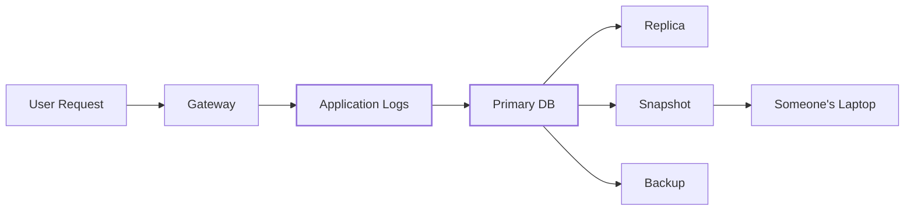
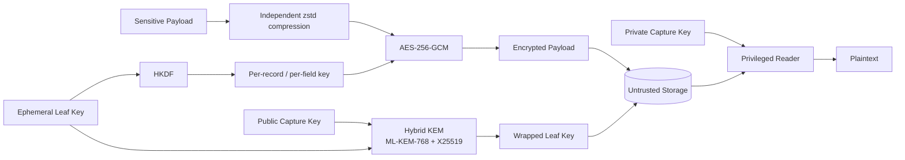
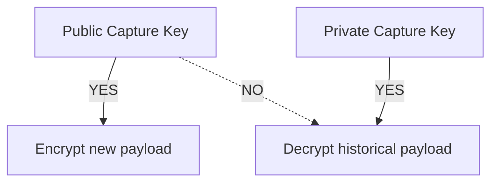

# scuttle

```text
$ cat scuttle

 ███████╗ ██████╗██╗   ██╗████████╗████████╗██╗     ███████╗
 ██╔════╝██╔════╝██║   ██║╚══██╔══╝╚══██╔══╝██║     ██╔════╝
 ███████╗██║     ██║   ██║   ██║      ██║   ██║     █████╗
 ╚════██║██║     ██║   ██║   ██║      ██║   ██║     ██╔══╝
 ███████║╚██████╗╚██████╔╝   ██║      ██║   ███████╗███████╗
 ╚══════╝ ╚═════╝ ╚═════╝    ╚═╝      ╚═╝   ╚══════╝╚══════╝

 민감한 데이터를 위한 작은 하이브리드 포스트 양자 암호화.

 > 어디서나 봉인하고.
 > 다른 곳에서 연다.
 > 데이터베이스를 훔쳐 봐야 얻는 건 암호문뿐.
 >
 > 부디 깨 보세요.
```

[](https://go.dev/)
[](LICENSE)
[](#암호학적-구성)
[](#암호학적-구성)
[](#상태)

<p align="center">
  <a href="README.md">English</a> ·
  <a href="README.zh-CN.md">简体中文</a> ·
  <a href="README.ja.md">日本語</a> ·
  <b>한국어</b> ·
  <a href="README.de.md">Deutsch</a> ·
  <a href="README.fr.md">Français</a> ·
  <a href="README.es.md">Español</a>
</p>


`scuttle`은 민감한 애플리케이션 로그를 위한 오픈 소스 암호화 계층입니다.

요청과 응답 페이로드를 일시적으로 관찰할 수 있어야 하지만, 그 사본이
데이터베이스, 레플리카, 스냅샷, 백업에 수년간 남아 있을 수 있는 시스템을
위해 설계되었습니다.

일반 애플리케이션 플릿은 **공개 캡처 키만** 받습니다. 이 키로 새 로그를
암호화할 수는 있지만, 과거 로그를 복호화하는 데는 사용할 수 없습니다.

수명이 긴 키 자료는 **ML-KEM-768 + X25519를 사용하는 하이브리드 포스트 양자
구성**으로 보호되며, 페이로드는 독립적으로 파생된 필드 키를 사용해
**AES-256-GCM**으로 암호화됩니다.

> **scuttle은 [OrcaRouter](https://www.orcarouter.ai/)에서 민감한 로그
> 페이로드를 위한 양자 내성 암호화 계층으로 사용되고 있습니다.**
>
> 이 오픈 소스 라이브러리는 그 구성을 공개적으로 검토하고, 퍼징하고,
> 공격하고, 개선할 수 있도록 공개되었습니다.

---

## 깨 보세요.

**우리는 사람들이 이것을 공격해 주기를 원합니다.**

암호는 그 가정이 명시적이고, 사람들이 그 가정이 무너지는 지점을 찾을
동기가 있을 때 더 강해집니다.

[`ATTACK.md`](ATTACK.md)에는 이 시스템이 제공한다고 우리가 믿는 보안
속성이, 우리가 틀렸을 때 치르게 될 비용이 큰 순서대로, 그 가정들을 겨냥한
퍼즈 타깃과 함께 나열되어 있습니다.

뭔가 찾으셨나요?

→ [`SECURITY.md`](SECURITY.md)를 읽고  
→ 재현하고  
→ 불변식을 깨고  
→ 우리가 무엇을 틀렸는지 알려 주세요

## 상태

> **v0 — 독립적인 감사를 받지 않았습니다.**
>
> 와이어 포맷은 안정적이지 않습니다. 잃어버리거나 영구적으로 읽을 수 없게
> 되어서는 안 되는 데이터에는 아직 사용하지 마세요.

---

# 왜 “scuttle”인가?

배를 **scuttle**한다는 것은 적에게 나포되기 전에 일부러 그 배를 쓸 수 없게
만드는 것을 뜻합니다.

Scuttle은 같은 발상을 민감한 데이터에 적용합니다.

```text
             attacker captures storage

                       │
                       ▼

              ┌─────────────────┐
              │    DATABASE     │
              │                 │
              │  █ ciphertext   │
              │  █ wrapped keys │
              │  █ metadata     │
              └────────┬────────┘
                       │
                       │  no capture private key
                       ▼

                 ┌───────────┐
                 │ ¯\_(ツ)_/¯ │
                 └───────────┘

               got the database.
                 not the data.
```

---

# 문제

AI 인프라는 유난히 민감한 로그를 만들어 냅니다.

요청 하나에 다음이 담길 수 있습니다.

- 프롬프트
- 모델 응답
- 소스 코드
- API 출력
- 검색된 문서
- 개인 식별 정보(PII)
- 컨텍스트에 실수로 포함된 자격 증명
- 에이전트 도구 호출
- 회사 독점 데이터

일반적인 로깅 아키텍처는 결국 다음과 같은 모습이 됩니다.



30일 뒤에 행을 삭제한다고 해서 어제의 백업, oplog 항목, 뒤처진 레플리카,
오래된 스냅샷까지 반드시 삭제되는 것은 아닙니다.

스토리지 계층에서만 암호화한다는 것은, 데이터베이스의 정상적인 복호화
경로를 손에 넣은 누구든 평문을 얻을 수 있다는 뜻이기도 합니다.

`scuttle`은 암호화를 **저장 이전**으로 옮깁니다.

---

# 아키텍처



중요한 경계는 다음과 같습니다.

```text
┌──────────────────────── ORCAROUTER DATA PLANE ────────────────────────┐
│                                                                       │
│  API Gateway      Workers       Relays       Logging Infrastructure   │
│      │               │             │                  │               │
│      └───────────────┴─────────────┴──────────────────┘               │
│                              │                                        │
│                    PUBLIC CAPTURE KEY ONLY                             │
│                              │                                        │
│                        can encrypt                                    │
│                     cannot open history                               │
│                                                                       │
└──────────────────────────────┬────────────────────────────────────────┘
                               │
                               ▼
                    ┌─────────────────────┐
                    │  UNTRUSTED STORAGE  │
                    │                     │
                    │  encrypted payload  │
                    │  wrapped leaf key   │
                    │  metadata           │
                    └──────────┬──────────┘
                               │
                  separate trust boundary
                               │
                               ▼
                    ┌─────────────────────┐
                    │ PRIVILEGED READER   │
                    │                     │
                    │ capture private key │
                    │ access controls     │
                    │ audit boundary      │
                    └─────────────────────┘
```

따라서 데이터베이스 자격 증명은 과거 프롬프트를 복호화하는 자격 증명이
되도록 의도되지 않았습니다.

---

# 암호학적 구성

scuttle은 모든 프리미티브를 포스트 양자 프리미티브로 **대체하지 않습니다**.

포스트 양자 암호는 장기적인 양자 위협이 실제로 중요한 곳에 배치합니다.

```text
                         SCUTTLE

 Payload
    │
    ▼
┌──────────────┐
│     zstd     │       compress independently
└──────┬───────┘
       │
       ▼
┌──────────────┐
│ AES-256-GCM  │ ◀──── HKDF-derived field key
└──────┬───────┘
       │
       ▼
  Ciphertext
       │
       │ stored together with
       ▼
┌──────────────────────────────┐
│ Wrapped Leaf Key             │
│                              │
│ ML-KEM-768  ─┐               │
│              ├─ Hybrid KEM   │
│ X25519 ──────┘               │
│                              │
│        X-Wing construction   │
└──────────────────────────────┘
```

## 왜 AES-256인가?

페이로드 암호화에는 **AES-256-GCM**을 사용합니다.

미래에 암호학적으로 의미 있는 양자 컴퓨터가 등장하더라도, 그것이 대칭 암호의
보안 분석에 미치는 영향은 공개 키 암호와 다릅니다. Grover 알고리즘은 널리
배포된 고전적 공개 키 시스템에 Shor 알고리즘이 일으키는 종류의 붕괴가 아니라,
범용적인 제곱근 수준의 탐색 개선을 제공할 뿐입니다.

따라서 256비트 대칭 키를 사용하면 오래 보관되는 암호화 데이터에 충분한 보안
여유를 확보할 수 있습니다.

프롬프트의 모든 바이트에 ML-KEM을 돌릴 이유는 없습니다.

데이터에는 대칭 암호를 사용하세요.

키를 보호하는 데는 포스트 양자 암호를 사용하세요.

---

## 왜 ML-KEM-768인가?

장기적인 위험은 키 캡슐화 경계에 있습니다.

공격자는 암호화된 트래픽이나 백업을 **오늘** 복사해 보관해 두었다가, 그 키를
보호하는 암호가 깨질 수 있게 되면 나중에 복호화를 시도할 수 있습니다.

이것이 바로 **지금 수집하고 나중에 복호화하는(harvest-now, decrypt-later)** 위협입니다.

```text
2026                                      FUTURE

capture encrypted logs
        │
        ▼
██████████████████████████████████████████████►
        │                                      │
        │ keep ciphertext                      │
        │                                      ▼
        │                              cryptographically
        │                              relevant quantum
        │                              computers?
        │                                      │
        └──────────────────────────────────────┘
                         try to decrypt history
```

그래서 scuttle은 포스트 양자 키 캡슐화 메커니즘인 **ML-KEM-768**로 리프 키를
래핑합니다.

---

## 왜 하이브리드 ML-KEM-768 + X25519인가?

성숙한 프리미티브를 더 새로운 프리미티브로 교체하는 것은 또 다른 종류의
위험을 낳기 때문입니다.

scuttle은 다음을 결합합니다.

```text
        ML-KEM-768
             │
             ├──────► HYBRID SECRET
             │
          X25519
```

이 결합은 하이브리드 **X-Wing** 구성을 통해 이루어집니다.

목표는 심층 방어입니다.

| 구성 요소 | 목적 |
|---|---|
| **ML-KEM-768** | 미래의 양자 공격에 대한 보호 |
| **X25519** | 성숙한 고전 타원 곡선 보안 |
| **하이브리드 구성** | 어느 한쪽 가정에만 전적으로 의존하지 않기 |
| **AES-256-GCM** | 인증된 페이로드 암호화 |
| **HKDF** | 도메인이 분리된 필드 키 파생 |
| **AAD** | 암호문을 그 컨텍스트에 암호학적으로 결속 |

이것이 scuttle이 단순히 X25519를 ML-KEM으로 바꾼 것이 아니라 스스로를
**하이브리드 포스트 양자 암호화**라고 부르는 이유입니다.

---

# 정확히 무엇이 암호화되는가?

민감한 각 필드는 독립적으로 암호화됩니다.

개념적인 레코드를 예로 들면:

```json
{
  "request_id": "req_01JQ8F7YKX2M",
  "model": "example/model",
  "status": 200,

  "request_body":  "<encrypted>",
  "response_body": "<encrypted>"
}
```

scuttle은 각 필드마다 서로 다른 AES-256 키를 파생합니다.

```text
(leaf, record, request_body)
            │
            └── HKDF ──► AES key A

(leaf, record, response_body)
            │
            └── HKDF ──► AES key B
```

콘텐츠 키는 **저장되지 않고 파생됩니다**.

따라서 필드 키 하나가 유출되더라도 그것이 데이터베이스 전체를 복호화하는 만능
키가 되지는 않습니다.

---

# 암호문은 자신의 컨텍스트에 속한다

데이터베이스는 신뢰할 수 없는 것으로 간주합니다.

AES-GCM의 연관 데이터는 암호문을 다음 값들에 결속합니다.

```text
schema version
      +
epoch
      +
leaf
      +
tenant / workspace
      +
user
      +
record ID
      +
field name
```

이 값들은 인증 전에 모호함 없이 인코딩됩니다.

즉, 공격자는 다음 암호문을 가져다가:

```text
Tenant A
Request 123
response_body
```

다음 위치에 이식하고:

```text
Tenant B
Request 456
request_body
```

인증에 성공하게 만들 수 없어야 합니다.

데이터베이스는 암호문을 저장합니다.

하지만 그 암호문이 무엇을 의미하는지 다시 정의할 수는 없습니다.

---

# 행 인증: `AuthKey`

결속은 공격자가 암호문을 **옮기는** 것을 막습니다. 하지만 그것만으로는 공격자가
**새 암호문을 써 넣는** 것을 막지 못합니다.

캡처 키는 설계상 공개되어 있습니다. 따라서 스토리지에 쓸 수 있는 사람이라면
누구나 자기 리프를 만들고, 원하는 텍스트를 임의의 테넌트 결속으로 봉인해 삽입할
수 있습니다. 인증 키가 없으면 그 행은 깔끔하게 열리고 진짜 로그와 똑같아
보입니다. 하류의 무언가(지원 도구, 분석 작업, 자기 로그를 읽는 LLM)가 자신이
읽은 내용을 신뢰한다면 이는 중요한 문제입니다.

`Envelope.AuthKey`가 이 틈을 막습니다.

```go
env := scuttle.Envelope{
    MaxPlaintext: 256 << 10,
    AuthKey:      authKey, // 32 secret bytes, writers + readers, never stored with data
}
```

`AuthKey`가 있으면 필드별 키는
`HKDF(salt = AuthKey, ikm = leaf key, info = binding)`가 됩니다. 위조자는 자기
리프 키를 고를 수 있지만 `AuthKey`는 모르므로, 필드 키를 파생할 수 없고 리더가
받아들이는 태그도 만들어 낼 수 없습니다.

이것으로 얻는 것과 얻지 못하는 것:

| | `AuthKey` 없음 | `AuthKey` 있음 |
|---|---|---|
| 탈취한 덤프 읽기 | ❌ 불가 | ❌ 불가 |
| 암호문을 다른 테넌트 / 레코드 / 필드로 이동 | ❌ 실패 | ❌ 실패 |
| 스토리지 작성자가 **새 행을 심기** | ⚠️ **진짜로 열림** | ❌ 실패 |
| 침해된 작성자가 행을 심기 | ⚠️ 가능 | ⚠️ 가능 — 키를 쥐고 있으므로 어차피 거짓 로그를 쓸 수 있음 |
| 스토리지 작성자가 행을 **삭제**하거나 **숨기기** | ⚠️ 가능 | ⚠️ 가능 — 암호화로는 삭제를 막을 수 없음 |

이것을 켜는 것은 **전환(cutover)**입니다. `AuthKey`를 가진 리더는 `AuthKey` 없이
봉인된 행을 거부합니다. 그렇지 않으면 위조자는 그냥 인증되지 않은 행을 쓰면 되기
때문입니다. 인증된 행에는 새로운 `Binding.SchemaVersion`을 사용해, 리더가 각
행을 어떤 봉투로 열어야 하는지 알 수 있게 하세요.

`AuthKey`는 256비트 대칭 키이므로 양자 공격에 대한 노출을 추가로 만들지 않습니다.

---

# 쓰기 전용 캡처

이것은 이 설계에서 가장 중요한 속성 중 하나입니다.

일반 작성자가 받는 것은:

```text
PUBLIC CAPTURE KEY
```

이지, 다음이 아닙니다.

```text
DATABASE MASTER DECRYPTION KEY
```

그래서:



따라서 릴레이, 게이트웨이, 워커는 과거 로그 데이터베이스를 복호화하는 능력을
자동으로 얻지 않고도 데이터를 암호화할 수 있습니다.

이것이 API가 다음을:

```go
LeafSealer
```

다음과 분리하는 이유입니다.

```go
Keyring
```

양쪽을 같은 프로세스에 두면 이 신뢰 분리가 무너집니다.

---

# 모든 레코드는 자기 완결적이다

저장된 모든 레코드는 자신의 래핑된 리프 키를 함께 지닙니다.

```text
┌────────────────────────────────────────┐
│ Stored Record                          │
│                                        │
│ metadata                               │
│ encrypted request                     │
│ encrypted response                    │
│ wrapped leaf key                      │
│ capture-key generation                │
└────────────────────────────────────────┘
```

애플리케이션과 함께 살아남아야 하는 인메모리 키 배포 데이터베이스는 없습니다.

적절한 캡처 개인 키를 가진 리더는 다음과 같은 상황 이후에도 리프 키를 복구할 수
있습니다.

- 프로세스 재시작
- 배포
- 레플리카 변경
- 페일오버
- 머신 교체

---

# 키 로테이션

캡처 키는 세대(generation)를 인식합니다.

```text
Generation 3      ACTIVE
Generation 2      decrypt only
Generation 1      decrypt only
```

로테이션은 다음과 같이 됩니다.

```go
// seeds[0] is ACTIVE — what NewLeaf seals under.
// Remaining seeds only open historical records.

keyring, _ := scuttle.NewLocalKeyringMulti(
    [][]byte{newSeed, oldSeed},
)
```

새 레코드는 가장 최신 캡처 키를 사용합니다.

오래된 레코드는 그에 대응하는 퇴역 키가 키링에 남아 있는 동안 계속 읽을 수
있습니다.

보존 정책이 오래된 세대로 보호되던 모든 것을 제거하고 나면, 그 세대는 제거해도
됩니다.

중복된 시드는 로테이션이 일어난 척 조용히 넘어가지 않고 거부됩니다.

레코드에 세대 표시가 붙기 전에 기록된 행(`KemKeyID`가 비어 있음)은 활성 세대부터
시작해 키링의 모든 세대로 시도됩니다. HPKE 열기는 인증되므로 이는 안전합니다.
잘못된 세대는 잘못된 키를 만들어 내는 대신 태그 검증에서 실패합니다.

---

# 압축은 암호화 전에 일어난다

```text
plaintext
   │
   ▼
 zstd
   │
   ▼
AES-256-GCM
   │
   ▼
ciphertext
```

암호화된 데이터는 사실상 압축할 수 없습니다.

먼저 압축하면 스토리지 엔진의 압축 효율을 망가뜨리지 않을 수 있습니다.

각 필드는 독립적으로 압축됩니다. scuttle은 한 테넌트의 공격자가 제어하는
데이터가 다른 테넌트의 비밀과 함께 압축되는 공유 압축 컨텍스트를 의도적으로
만들지 않습니다.

---

# 사용법

```go
// ─────────────────────────────────────────────────────────────
// WRITER
//
// Holds a PUBLIC capture key.
// Can seal new data.
// Cannot use that key to open historical data.
// ─────────────────────────────────────────────────────────────

// Keys: `go run ./cmd/scuttle-keygen` prints a fresh set.
capturePublicKey, _ := scuttle.ParsePublicKey(os.Getenv("SCUTTLE_CAPTURE_PUBLIC_KEY"))
authKey, _ := scuttle.ParseAuthKey(os.Getenv("SCUTTLE_AUTH_KEY"))

sealer, _ := scuttle.NewLeafSealer(capturePublicKey)

leafKey, sealed, _ := sealer.NewLeaf(
    "tenant:42|user:7|2026-09-12T10",
)

// Keep leafKey in memory only for the chosen lifetime.
// Store sealed.Blob with the record.

// Writers and readers must use the same Envelope configuration.
// Seal refuses a body over MaxPlaintext (ErrPlaintextTooLarge) rather than
// writing a row Open would refuse.
env := scuttle.Envelope{
    MaxPlaintext: 256 << 10,
    AuthKey:      authKey,
}

bind := scuttle.Binding{
    SchemaVersion: 1,
    LeafID:        sealed.LeafID,
    WorkspaceID:   42,
    UserID:        7,
    RequestID:     "req_01JQ8F7YKX2M",
}

ct, _ := env.Seal(
    leafKey,
    bind,
    scuttle.FieldRequestBody,
    payload,
)
```

열기는 특권 측에서 이루어집니다.

```go
// ─────────────────────────────────────────────────────────────
// READER
//
// Privileged.
// Keep this trust boundary away from ordinary writers.
// ─────────────────────────────────────────────────────────────

seed, _ := scuttle.ParseCaptureSeed(os.Getenv("SCUTTLE_CAPTURE_SEED"))

keyring, _ := scuttle.NewLocalKeyring(seed)

key, err := keyring.OpenLeaf(ctx, sealed)

switch {
case errors.Is(err, scuttle.ErrKeyUnavailable):
    // Retryable: a remote keyring is unreachable, or ctx ended.

case errors.Is(err, scuttle.ErrUndecryptable):
    // NOT retryable.
    // Treat this as a fault worth investigating.
}

defer zero(key)

plaintext, err := env.Open(
    key,
    bind,
    scuttle.FieldRequestBody,
    ct,
)
```

---

# 실패의 의미가 중요하다

이 두 오류는 의도적으로 서로 다른 의미를 가집니다.

### `ErrKeyUnavailable`

복호화 인프라가 현재 필요한 키를 제공할 수 없습니다.

**재시도할 수 있는 경우가 있습니다.**

### `ErrUndecryptable`

레코드를 주어진 상태 그대로는 복호화할 수 없습니다.

**일반적인 재시도 조건이 아닙니다. 조사하세요.**

둘을 뒤섞으면 인프라 장애가 데이터 손상처럼 보이게 되거나, 더 나쁘게는 실제
암호학적 결함이 끝없는 재시도로 바뀝니다.

봉인된 리프가 아예 없는 행은 `ErrUndecryptable`입니다. 모든 레코드는 자신의
리프를 지니므로, 기다린다고 해서 리프가 생겨나지는 않습니다.

그 밖의 두 오류는 행이 아니라 **여러분의 코드**에 관한 것입니다.

- **`ErrPlaintextTooLarge`** — `Seal`에 봉투의 상한을 넘는 본문이 주어졌습니다.
  아무것도 기록되지 않았습니다.
- **`ErrInvalidConfig`** — 크기가 잘못되었거나 모두 0인 `AuthKey`,
  `MaxPlaintextCeiling`(16 MiB)을 넘는 `MaxPlaintext`, 또는 형식이 잘못된 키
  문자열입니다. 배포 설정을 고치세요.

이 절의 전체 실행 가능한 버전은
[`example_test.go`](example_test.go)에 있습니다.

---

# 위협 모델

scuttle은 다음과 같은 시나리오의 결과를 개선하도록 설계되었습니다.

| 사건 | 의도된 결과 |
|---|---|
| 데이터베이스 자격 증명 탈취 | 페이로드는 암호화된 상태로 유지 |
| 데이터베이스 덤프 탈취 | 페이로드는 암호화된 상태로 유지 |
| 백업 유출 | 페이로드는 암호화된 상태로 유지 |
| 스냅샷 노출 | 페이로드는 암호화된 상태로 유지 |
| 스토리지 관리자가 DB를 읽음 | 스토리지만으로는 페이로드 평문을 얻을 수 없음 |
| 작성자 침해 | 캡처 공개 키로 과거 데이터베이스를 자동으로 복호화할 수 없음 |
| 암호문을 테넌트 간에 이동 | 인증 실패 |
| 기존 암호문 변조 | 인증 실패 |
| 스토리지 작성자가 **새로 위조한** 행을 삽입 | **`Envelope.AuthKey`가 있을 때만** 실패. 없으면 그 행은 진짜로 열림 |
| 고전적 키 교환에 대한 미래의 양자 공격 | ML-KEM 계층이 포스트 양자 보호를 제공 |

마지막 행이 바로 포스트 양자 계층이 존재하는 이유입니다.

---

# scuttle이 보호하지 **않는** 것

보안 주장은 그 경계가 명시적일 때 더 유용합니다.

### 데이터를 지우지 않습니다

암호화 키를 파기해 과거 암호문을 영구적으로 읽을 수 없게 만드는 것,
즉 **암호학적 삭제(cryptographic erasure)**는 별개의 문제입니다.

### 메타데이터를 숨기지 않습니다

조회에 필요한 정보는 계속 보일 수 있으며, 여기에는 다음과 같은 것들이 포함됩니다.

- 타임스탬프
- 페이로드 크기
- 모델 이름
- 상태 코드
- 식별자

데이터베이스에 접근할 수 있는 공격자는 여전히 중요한 트래픽 메타데이터를 알아낼
수 있습니다.

### 프로세스 메모리 속 평문을 보호하지 않습니다

애플리케이션은 평문을 처리하는 동안 필연적으로 그것을 봅니다.

침해된 프로세스, 메모리 덤프, 디버거, 또는 충분한 권한을 가진 런타임 계측 도구는
그 평문을 볼 수 있습니다.

### 권한 있는 리더를 막지 않습니다

어떤 신원이 평문을 요청할 정당한 권한을 가지고 있다면, 그 요청을 허용할지 판단하는
책임은 여전히 접근 제어에 있습니다.

scuttle은 암호학적 자료를 보호합니다.

권한 부여 시스템은 아닙니다.

### 프로세스 내 Keyring은 쓰기 전용이 아닙니다

작성자 프로세스가 캡처 개인 키까지 가지고 있다면, 그 프로세스를 침해하는 것만으로
현재 리프 윈도뿐 아니라 모든 과거 레코드를 얻게 됩니다. 쓰기 전용 속성은 캡처
시드가 작성자들이 없는 곳, 즉 별도의 리더 서비스나 여러분이 직접 구현한
`Keyring` 인터페이스 뒤의 KMS / HSM에 있을 때에만 성립합니다.

### 전방 비밀성이 없습니다

캡처 시드는 수명이 긴 단일 루트 비밀입니다. 오늘이든 2040년이든 그것을 손에 넣은
사람은 그 공개 키로 봉인되어 아직 남아 있는 모든 레코드를 열 수 있습니다. 포스트
양자 래핑은 시드를 **가지지 않은** 사람으로부터 보호해 줄 뿐, 시드를 가진 사람에
대해서는 아무것도 해 주지 못합니다. 시드는 KMS나 HSM에 보관하고, 가능한 한 적은
프로세스에만 주고, 로테이션하고, 오래된 세대가 보호하던 것은 보존 정책이 삭제하게
하세요.

### 기본적으로 행을 인증하지 않습니다

`Envelope.AuthKey`가 없으면 스토리지에 쓸 수 있는 누구나 진짜처럼 복호화되는 행을
삽입할 수 있습니다. [행 인증](#행-인증-authkey)을 참고하세요.

### 삭제나 롤백을 막지 않습니다

쓰기 권한이 있는 공격자는 행을 삭제하거나 숨길 수 있습니다. 암호화로는 존재하지
않는 행을 감지할 수 없습니다.

### 감사를 받지 않았습니다

scuttle은 **v0이며 독립적인 감사를 받지 않았습니다**. 프리미티브는 표준적인 것
(Go 프로젝트의 `crypto/hpke`, AES-GCM, HKDF)이지만, 그것들을 조합하는 방식은
우리가 만든 것입니다. [`SPEC.md`](SPEC.md)는 포맷을 정확하게 설명하고,
[`ATTACK.md`](ATTACK.md)는 깨 볼 만한 주장들을 나열합니다.

---

# 더 읽을거리

- [`SPEC.md`](SPEC.md) — 바이트 단위의 와이어 포맷과
  [`testdata/vectors.json`](testdata/vectors.json)의 테스트 벡터.
- [`ATTACK.md`](ATTACK.md) — 주장들과, 그것을 겨냥한 퍼즈 타깃.
- [`SECURITY.md`](SECURITY.md) — 발견한 문제를 보고하는 방법.
- [`CHANGELOG.md`](CHANGELOG.md) — 포맷 변경을 포함한 변경 사항.
- [`CONTRIBUTING.md`](CONTRIBUTING.md) — 개발에 참여하는 방법.

[Apache License 2.0](LICENSE)에 따라 라이선스가 부여됩니다.
