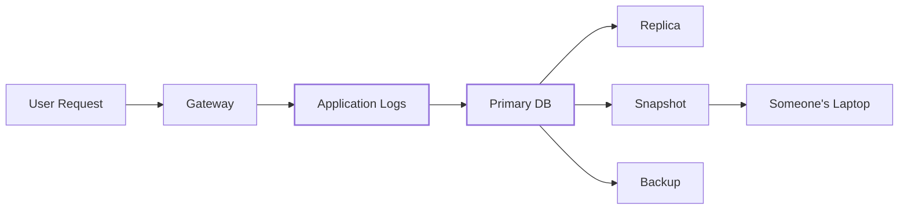
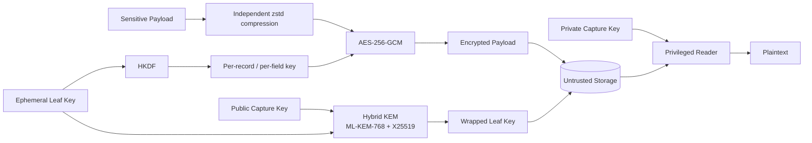
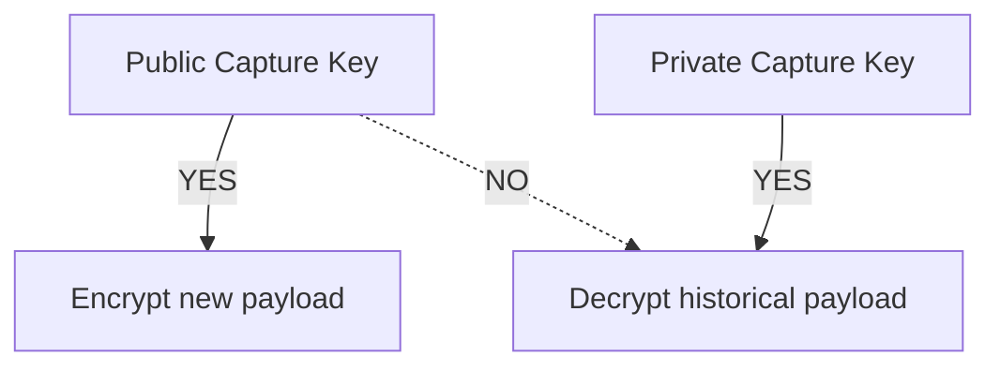

# scuttle

```text
$ cat scuttle

 ███████╗ ██████╗██╗   ██╗████████╗████████╗██╗     ███████╗
 ██╔════╝██╔════╝██║   ██║╚══██╔══╝╚══██╔══╝██║     ██╔════╝
 ███████╗██║     ██║   ██║   ██║      ██║   ██║     █████╗
 ╚════██║██║     ██║   ██║   ██║      ██║   ██║     ██╔══╝
 ███████║╚██████╗╚██████╔╝   ██║      ██║   ███████╗███████╗
 ╚══════╝ ╚═════╝ ╚═════╝    ╚═╝      ╚═╝   ╚══════╝╚══════╝

 tiny hybrid post-quantum encryption for sensitive data.

 > seal everywhere.
 > open somewhere else.
 > steal the database, get ciphertext.
 >
 > PLEASE BREAK IT.
```

[](https://go.dev/)
[](LICENSE)
[](#the-cryptographic-construction)
[](#the-cryptographic-construction)
[](#status)

<p align="center">
  <b>English</b> ·
  <a href="README.zh-CN.md">简体中文</a> ·
  <a href="README.ja.md">日本語</a> ·
  <a href="README.ko.md">한국어</a> ·
  <a href="README.de.md">Deutsch</a> ·
  <a href="README.fr.md">Français</a> ·
  <a href="README.es.md">Español</a>
</p>


`scuttle` is an open-source encryption layer for sensitive application logs.

It is designed for systems where request and response payloads need to be
temporarily observable, but copies may survive for years in databases,
replicas, snapshots and backups.

The normal application fleet receives **only a public capture key**. It can
encrypt new logs, but cannot use that key to decrypt historical ones.

Long-lived key material is protected with a **hybrid post-quantum construction
using ML-KEM-768 + X25519**, while payloads are encrypted using
**AES-256-GCM** with independently derived field keys.

> **scuttle is used as the quantum-safe encryption layer for sensitive log
> payloads at [OrcaRouter](https://www.orcarouter.ai/).**
>
> The open-source library is published so the construction can be inspected,
> fuzzed, attacked and improved in public.

---

## Break it.

**We want people to attack this.**

Cryptography gets stronger when its assumptions are explicit and people are
incentivized to find where they fail.

[`ATTACK.md`](ATTACK.md) lists the security properties we believe the system
provides, ordered by how expensive it would be for us to be wrong, together
with fuzz targets aimed at those assumptions.

Found something?

→ Read [`SECURITY.md`](SECURITY.md)  
→ Reproduce it  
→ Break an invariant  
→ Tell us what we got wrong

## Status

> **v0 — not independently audited.**
>
> The wire format is not stable. Do not use this yet for data you cannot
> afford to lose or make permanently unreadable.

---

# Why “scuttle”?

To **scuttle** a ship is to deliberately make it unusable before an adversary
can capture it.

Scuttle applies the same idea to sensitive data.

```text
             attacker captures storage

                       │
                       ▼

              ┌─────────────────┐
              │    DATABASE     │
              │                 │
              │  █ ciphertext   │
              │  █ wrapped keys │
              │  █ metadata     │
              └────────┬────────┘
                       │
                       │  no capture private key
                       ▼

                 ┌───────────┐
                 │ ¯\_(ツ)_/¯ │
                 └───────────┘

               got the database.
                 not the data.
```

---

# The problem

AI infrastructure produces unusually sensitive logs.

A single request can contain:

- prompts
- model responses
- source code
- API output
- retrieved documents
- PII
- credentials accidentally included in context
- agent tool calls
- proprietary company data

A normal logging architecture eventually looks like this:



Deleting a row after 30 days does not necessarily delete yesterday's backup,
an oplog entry, a lagging replica or an old snapshot.

Encryption only at the storage layer also means that whoever obtains the
database's normal decryption path may obtain the plaintext.

`scuttle` moves encryption **before storage**.

---

# The architecture



The important boundary is:

```text
┌──────────────────────── ORCAROUTER DATA PLANE ────────────────────────┐
│                                                                       │
│  API Gateway      Workers       Relays       Logging Infrastructure   │
│      │               │             │                  │               │
│      └───────────────┴─────────────┴──────────────────┘               │
│                              │                                        │
│                    PUBLIC CAPTURE KEY ONLY                             │
│                              │                                        │
│                        can encrypt                                    │
│                     cannot open history                               │
│                                                                       │
└──────────────────────────────┬────────────────────────────────────────┘
                               │
                               ▼
                    ┌─────────────────────┐
                    │  UNTRUSTED STORAGE  │
                    │                     │
                    │  encrypted payload  │
                    │  wrapped leaf key   │
                    │  metadata           │
                    └──────────┬──────────┘
                               │
                  separate trust boundary
                               │
                               ▼
                    ┌─────────────────────┐
                    │ PRIVILEGED READER   │
                    │                     │
                    │ capture private key │
                    │ access controls     │
                    │ audit boundary      │
                    └─────────────────────┘
```

A database credential is therefore not intended to be a historical
prompt-decryption credential.

---

# The cryptographic construction

scuttle does **not** replace every primitive with a post-quantum primitive.

It puts post-quantum cryptography where the long-term quantum threat actually
matters.

```text
                         SCUTTLE

 Payload
    │
    ▼
┌──────────────┐
│     zstd     │       compress independently
└──────┬───────┘
       │
       ▼
┌──────────────┐
│ AES-256-GCM  │ ◀──── HKDF-derived field key
└──────┬───────┘
       │
       ▼
  Ciphertext
       │
       │ stored together with
       ▼
┌──────────────────────────────┐
│ Wrapped Leaf Key             │
│                              │
│ ML-KEM-768  ─┐               │
│              ├─ Hybrid KEM   │
│ X25519 ──────┘               │
│                              │
│        X-Wing construction   │
└──────────────────────────────┘
```

## Why AES-256?

Payload encryption uses **AES-256-GCM**.

A future cryptographically relevant quantum computer would change the security
analysis of symmetric cryptography differently from public-key cryptography.
Grover's algorithm gives a generic quadratic search improvement rather than
the kind of break Shor's algorithm creates for widely deployed classical
public-key systems.

Using a 256-bit symmetric key therefore provides substantial security margin
for long-lived encrypted data.

There is no reason to run ML-KEM over every byte of a prompt.

Use symmetric cryptography for the data.

Use post-quantum cryptography to protect the keys.

---

## Why ML-KEM-768?

The long-lived risk sits at the key-encapsulation boundary.

An attacker can copy encrypted traffic or backups **today**, retain them, and
attempt to decrypt them later if the cryptography protecting their keys becomes
breakable.

This is the **harvest-now, decrypt-later** threat.

```text
2026                                      FUTURE

capture encrypted logs
        │
        ▼
██████████████████████████████████████████████►
        │                                      │
        │ keep ciphertext                      │
        │                                      ▼
        │                              cryptographically
        │                              relevant quantum
        │                              computers?
        │                                      │
        └──────────────────────────────────────┘
                         try to decrypt history
```

scuttle therefore wraps leaf keys using **ML-KEM-768**, a post-quantum
key-encapsulation mechanism.

---

## Why hybrid ML-KEM-768 + X25519?

Because replacing a mature primitive with a newer primitive creates another
kind of risk.

scuttle combines:

```text
        ML-KEM-768
             │
             ├──────► HYBRID SECRET
             │
          X25519
```

through the hybrid **X-Wing** construction.

The goal is defense in depth:

| Component | Purpose |
|---|---|
| **ML-KEM-768** | Protection against future quantum attacks |
| **X25519** | Mature classical elliptic-curve security |
| **Hybrid construction** | Avoid depending exclusively on either assumption |
| **AES-256-GCM** | Authenticated payload encryption |
| **HKDF** | Domain-separated field-key derivation |
| **AAD** | Cryptographically binds ciphertext to its context |

This is why scuttle describes itself as **hybrid post-quantum encryption**,
rather than simply replacing X25519 with ML-KEM.

---

# What exactly gets encrypted?

Each sensitive field is encrypted independently.

For a conceptual record:

```json
{
  "request_id": "req_01JQ8F7YKX2M",
  "model": "example/model",
  "status": 200,

  "request_body":  "<encrypted>",
  "response_body": "<encrypted>"
}
```

scuttle derives a distinct AES-256 key for each:

```text
(leaf, record, request_body)
            │
            └── HKDF ──► AES key A

(leaf, record, response_body)
            │
            └── HKDF ──► AES key B
```

Content keys are **derived, not stored**.

One leaked field key therefore does not become a universal database
decryption key.

---

# Ciphertext belongs to its context

The database is considered untrusted.

AES-GCM associated data binds a ciphertext to:

```text
schema version
      +
epoch
      +
leaf
      +
tenant / workspace
      +
user
      +
record ID
      +
field name
```

These values are encoded unambiguously before authentication.

That means an attacker should not be able to take:

```text
Tenant A
Request 123
response_body
```

and transplant its ciphertext into:

```text
Tenant B
Request 456
request_body
```

and have it successfully authenticate.

The database stores the ciphertext.

It does not get to redefine what that ciphertext means.

---

# Authenticating rows: `AuthKey`

Binding stops an attacker **moving** a ciphertext. On its own it does not stop
them **writing a new one**.

The capture key is public by design. Anyone who can write to your storage can
therefore mint their own leaf, seal any text they like under any tenant's
binding, and insert it. Without an authentication key, that row opens cleanly
and looks exactly like a genuine log — which matters if anything downstream
(a support tool, an analytics job, an LLM reading its own logs) trusts what it
reads.

`Envelope.AuthKey` closes that:

```go
env := scuttle.Envelope{
    MaxPlaintext: 256 << 10,
    AuthKey:      authKey, // 32 secret bytes, writers + readers, never stored with data
}
```

With an `AuthKey`, the per-field key becomes
`HKDF(salt = AuthKey, ikm = leaf key, info = binding)`. A forger chooses their
own leaf key but does not know `AuthKey`, so they cannot derive the field key
and cannot produce a tag the reader accepts.

What it does and does not buy:

| | Without `AuthKey` | With `AuthKey` |
|---|---|---|
| Read a stolen dump | ❌ no | ❌ no |
| Move a ciphertext to another tenant / record / field | ❌ fails | ❌ fails |
| Storage writer **plants a new row** | ⚠️ **opens as genuine** | ❌ fails |
| Compromised writer plants a row | ⚠️ yes | ⚠️ yes — it holds the key; it could write false logs anyway |
| Storage writer **deletes** or **withholds** a row | ⚠️ yes | ⚠️ yes — encryption cannot prevent deletion |

Turning it on is a **cutover**. A reader with an `AuthKey` refuses rows sealed
without one; otherwise a forger would simply write unauthenticated rows. Use a
new `Binding.SchemaVersion` for authenticated rows so the reader knows which
envelope to open each row with.

The `AuthKey` is symmetric and 256-bit, so it adds no quantum exposure.

---

# Write-only capture

This is one of the most important properties of the design.

The normal writer receives:

```text
PUBLIC CAPTURE KEY
```

not:

```text
DATABASE MASTER DECRYPTION KEY
```

So:



A relay, gateway or worker can therefore encrypt data without automatically
receiving the capability to decrypt the historical log database.

This is why the API separates:

```go
LeafSealer
```

from:

```go
Keyring
```

Putting both sides in the same process destroys that trust separation.

---

# Every record is self-contained

Every stored record carries its own wrapped leaf key.

```text
┌────────────────────────────────────────┐
│ Stored Record                          │
│                                        │
│ metadata                               │
│ encrypted request                     │
│ encrypted response                    │
│ wrapped leaf key                      │
│ capture-key generation                │
└────────────────────────────────────────┘
```

There is no in-memory key-distribution database that has to survive alongside
the application.

Readers holding the appropriate capture private key can recover the leaf key
after:

- process restarts
- deployments
- replica changes
- failover
- machine replacement

---

# Key rotation

Capture keys are generation-aware.

```text
Generation 3      ACTIVE
Generation 2      decrypt only
Generation 1      decrypt only
```

Rotation becomes:

```go
// seeds[0] is ACTIVE — what NewLeaf seals under.
// Remaining seeds only open historical records.

keyring, _ := scuttle.NewLocalKeyringMulti(
    [][]byte{newSeed, oldSeed},
)
```

New records use the newest capture key.

Old records remain readable while their corresponding retired key remains in
the keyring.

Once retention has eliminated everything protected by an old generation, that
generation can be removed.

Repeated seeds are rejected rather than silently pretending that a rotation
occurred.

Rows written before records carried a generation stamp (`KemKeyID` empty) are
tried against every generation in the keyring, active first. That is safe
because the HPKE open is authenticated: the wrong generation fails its tag
instead of producing a wrong key.

---

# Compression happens before encryption

```text
plaintext
   │
   ▼
 zstd
   │
   ▼
AES-256-GCM
   │
   ▼
ciphertext
```

Encrypted data is effectively incompressible.

Compressing first avoids destroying storage-engine compression efficiency.

Each field is compressed independently. scuttle does not intentionally create
a shared compression context where attacker-controlled data from one tenant is
compressed together with another tenant's secret.

---

# Usage

```go
// ─────────────────────────────────────────────────────────────
// WRITER
//
// Holds a PUBLIC capture key.
// Can seal new data.
// Cannot use that key to open historical data.
// ─────────────────────────────────────────────────────────────

// Keys: `go run ./cmd/scuttle-keygen` prints a fresh set.
capturePublicKey, _ := scuttle.ParsePublicKey(os.Getenv("SCUTTLE_CAPTURE_PUBLIC_KEY"))
authKey, _ := scuttle.ParseAuthKey(os.Getenv("SCUTTLE_AUTH_KEY"))

sealer, _ := scuttle.NewLeafSealer(capturePublicKey)

leafKey, sealed, _ := sealer.NewLeaf(
    "tenant:42|user:7|2026-09-12T10",
)

// Keep leafKey in memory only for the chosen lifetime.
// Store sealed.Blob with the record.

// Writers and readers must use the same Envelope configuration.
// Seal refuses a body over MaxPlaintext (ErrPlaintextTooLarge) rather than
// writing a row Open would refuse.
env := scuttle.Envelope{
    MaxPlaintext: 256 << 10,
    AuthKey:      authKey,
}

bind := scuttle.Binding{
    SchemaVersion: 1,
    LeafID:        sealed.LeafID,
    WorkspaceID:   42,
    UserID:        7,
    RequestID:     "req_01JQ8F7YKX2M",
}

ct, _ := env.Seal(
    leafKey,
    bind,
    scuttle.FieldRequestBody,
    payload,
)
```

Opening happens on the privileged side:

```go
// ─────────────────────────────────────────────────────────────
// READER
//
// Privileged.
// Keep this trust boundary away from ordinary writers.
// ─────────────────────────────────────────────────────────────

seed, _ := scuttle.ParseCaptureSeed(os.Getenv("SCUTTLE_CAPTURE_SEED"))

keyring, _ := scuttle.NewLocalKeyring(seed)

key, err := keyring.OpenLeaf(ctx, sealed)

switch {
case errors.Is(err, scuttle.ErrKeyUnavailable):
    // Retryable: a remote keyring is unreachable, or ctx ended.

case errors.Is(err, scuttle.ErrUndecryptable):
    // NOT retryable.
    // Treat this as a fault worth investigating.
}

defer zero(key)

plaintext, err := env.Open(
    key,
    bind,
    scuttle.FieldRequestBody,
    ct,
)
```

---

# Failure semantics matter

These two errors deliberately mean different things.

### `ErrKeyUnavailable`

The decryption infrastructure cannot currently provide the required key.

**Potentially retryable.**

### `ErrUndecryptable`

The record cannot be decrypted as presented.

**Not a normal retry condition. Investigate it.**

Conflating the two turns infrastructure failures into apparent corruption —
or, worse, turns real cryptographic faults into infinite retries.

A row with no sealed leaf at all is `ErrUndecryptable`: every record carries
its own, so waiting will not produce one.

Two further errors describe **your code**, not a row:

- **`ErrPlaintextTooLarge`** — `Seal` was given a body over the envelope's cap.
  Nothing was written.
- **`ErrInvalidConfig`** — an `AuthKey` of the wrong size or all zeros, a
  `MaxPlaintext` above `MaxPlaintextCeiling` (16 MiB), or a malformed key
  string. Fix the deployment.

A full, runnable version of this section is in
[`example_test.go`](example_test.go).

---

# Threat model

scuttle is designed to improve the outcome of scenarios such as:

| Event | Intended result |
|---|---|
| Database credential stolen | Payload remains encrypted |
| Database dump stolen | Payload remains encrypted |
| Backup leaked | Payload remains encrypted |
| Snapshot exposed | Payload remains encrypted |
| Storage administrator reads DB | No payload plaintext from storage alone |
| Writer compromised | Historical database not automatically decryptable from capture public key |
| Ciphertext moved across tenants | Authentication fails |
| Existing ciphertext modified | Authentication fails |
| Storage writer inserts a **new, forged** row | Fails **only with `Envelope.AuthKey`**; without it the row opens as genuine |
| Future quantum attack against classical key exchange | ML-KEM layer provides PQ protection |

The last row is why the post-quantum layer exists.

---

# What scuttle does **not** protect

Security claims are more useful when their boundaries are explicit.

### It does not erase data

Destroying encryption keys so historical ciphertext becomes permanently
unreadable — **cryptographic erasure** — is a separate problem.

### It does not hide metadata

Information needed for querying may remain visible, including things such as:

- timestamps
- payload sizes
- model names
- status codes
- identifiers

An attacker with database access may still learn important traffic metadata.

### It does not protect plaintext in process memory

The application necessarily sees plaintext while processing it.

A compromised process, memory dump, debugger or sufficiently privileged
runtime instrumentation may see that plaintext.

### It does not defeat an authorized reader

If an identity is legitimately authorized to request plaintext, access control
remains responsible for deciding whether that request is allowed.

scuttle protects cryptographic material.

It is not an authorization system.

### An in-process Keyring is not write-only

If the writer process also holds the private capture key, compromising that
process yields every historical record, not just its current leaf window. The
write-only property exists only when the capture seed lives somewhere the
writers do not: a separate reader service, or a KMS / HSM behind your own
implementation of the `Keyring` interface.

### It has no forward secrecy

The capture seed is a single long-lived root secret. Whoever obtains it —
today or in 2040 — can open every record sealed under its public key that
still exists. Post-quantum wrapping protects against someone who does **not**
have the seed; it does nothing for someone who does. Keep the seed in a KMS or
HSM, give it to as few processes as possible, rotate it, and let retention
delete what old generations protected.

### It does not authenticate rows by default

Without `Envelope.AuthKey`, anyone who can write to storage can insert a row
that decrypts as genuine. See [Authenticating rows](#authenticating-rows-authkey).

### It does not prevent deletion or rollback

An attacker with write access can delete rows, or withhold them. Encryption
cannot detect a row that is not there.

### It is not audited

scuttle is **v0 and has not been independently audited**. The primitives are
standard (`crypto/hpke`, AES-GCM, HKDF from the Go project), but the way they
are combined is ours. [`SPEC.md`](SPEC.md) describes the format precisely, and
[`ATTACK.md`](ATTACK.md) lists the claims worth trying to break.

---

# Further reading

- [`SPEC.md`](SPEC.md) — the wire format, byte for byte, with test vectors in
  [`testdata/vectors.json`](testdata/vectors.json).
- [`ATTACK.md`](ATTACK.md) — the claims, and the fuzz targets aimed at them.
- [`SECURITY.md`](SECURITY.md) — how to report a finding.
- [`CHANGELOG.md`](CHANGELOG.md) — what changed, including format changes.
- [`CONTRIBUTING.md`](CONTRIBUTING.md) — how to work on it.

Licensed under the [Apache License 2.0](LICENSE).
