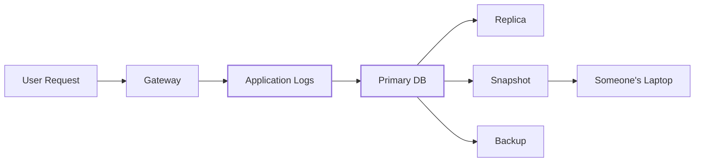
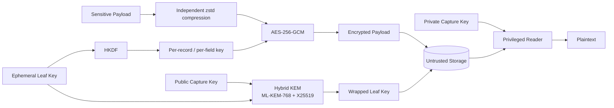
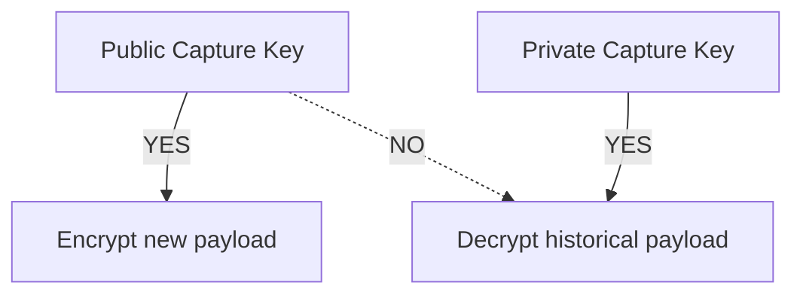

# scuttle

```text
$ cat scuttle

 ███████╗ ██████╗██╗   ██╗████████╗████████╗██╗     ███████╗
 ██╔════╝██╔════╝██║   ██║╚══██╔══╝╚══██╔══╝██║     ██╔════╝
 ███████╗██║     ██║   ██║   ██║      ██║   ██║     █████╗
 ╚════██║██║     ██║   ██║   ██║      ██║   ██║     ██╔══╝
 ███████║╚██████╗╚██████╔╝   ██║      ██║   ███████╗███████╗
 ╚══════╝ ╚═════╝ ╚═════╝    ╚═╝      ╚═╝   ╚══════╝╚══════╝

 面向敏感数据的轻量级混合后量子加密。

 > 随处封装。
 > 在别处打开。
 > 偷走数据库，拿到密文。
 >
 > 请来攻破它。
```

[](https://go.dev/)
[](LICENSE)
[](#密码学构造)
[](#密码学构造)
[](#状态)

<p align="center">
  <a href="README.md">English</a> ·
  <b>简体中文</b> ·
  <a href="README.ja.md">日本語</a> ·
  <a href="README.ko.md">한국어</a> ·
  <a href="README.de.md">Deutsch</a> ·
  <a href="README.fr.md">Français</a> ·
  <a href="README.es.md">Español</a>
</p>


`scuttle` 是一个面向敏感应用日志的开源加密层。

它适用于这样的系统：请求与响应的 payload 需要在一段时间内可被观察，
但其副本可能在数据库、副本、快照和备份中留存多年。

普通的应用集群**只持有一把公开的 capture 密钥**。它可以加密新的日志，
但无法用这把密钥解密历史日志。

长期密钥材料由**基于 ML-KEM-768 + X25519 的混合后量子构造**保护，
而 payload 则使用 **AES-256-GCM** 加密，每个字段的密钥独立派生。

> **scuttle 是 [OrcaRouter](https://www.orcarouter.ai/) 中敏感日志
> payload 的混合后量子加密层。**
>
> 我们公开发布这个开源库，是为了让这一构造能够被公开审查、
> 模糊测试、攻击和改进。

---

## 来攻破它。

**我们希望有人来攻击它。**

当密码学的假设被明确写出，并且有人有动力去寻找这些假设失效之处时，
它才会变得更强。

[`ATTACK.md`](ATTACK.md) 列出了我们认为本系统提供的安全性质，
按照一旦我们判断错误所付出的代价从高到低排列，并附有针对这些假设的
fuzz 目标。

发现了问题？

→ 阅读 [`SECURITY.md`](SECURITY.md)  
→ 复现它  
→ 打破某个不变量  
→ 告诉我们哪里做错了

## 状态

> **v0 —— 尚未经过独立审计。**
>
> 传输格式（wire format）尚不稳定。对于你承受不起丢失、
> 或承受不起永久无法读取的数据，请暂时不要使用它。

---

# 为什么叫“scuttle”？

**scuttle** 一艘船，是指在它被敌方俘获之前，故意将其凿沉、使其无法使用。

Scuttle 把同样的思路用在敏感数据上。

```text
             attacker captures storage

                       │
                       ▼

              ┌─────────────────┐
              │    DATABASE     │
              │                 │
              │  █ ciphertext   │
              │  █ wrapped keys │
              │  █ metadata     │
              └────────┬────────┘
                       │
                       │  no capture private key
                       ▼

                 ┌───────────┐
                 │ ¯\_(ツ)_/¯ │
                 └───────────┘

               got the database.
                 not the data.
```

---

# 问题所在

AI 基础设施会产生异常敏感的日志。

单个请求就可能包含：

- 提示词（prompt）
- 模型响应
- 源代码
- API 输出
- 检索到的文档
- 个人身份信息（PII）
- 意外混入上下文的凭据
- agent 的工具调用
- 公司的专有数据

一个普通的日志架构最终往往会变成这样：



30 天后删除一行，并不一定会删除昨天的备份、某条 oplog 记录、
一个落后的副本或一份旧快照。

只在存储层加密也意味着：谁拿到了数据库正常的解密路径，
谁就可能拿到明文。

`scuttle` 把加密挪到了**存储之前**。

---

# 架构



关键的边界在于：

```text
┌──────────────────────── ORCAROUTER DATA PLANE ────────────────────────┐
│                                                                       │
│  API Gateway      Workers       Relays       Logging Infrastructure   │
│      │               │             │                  │               │
│      └───────────────┴─────────────┴──────────────────┘               │
│                              │                                        │
│                    PUBLIC CAPTURE KEY ONLY                            │
│                              │                                        │
│                        can encrypt                                    │
│                     cannot open history                               │
│                                                                       │
└──────────────────────────────┬────────────────────────────────────────┘
                               │
                               ▼
                    ┌─────────────────────┐
                    │  UNTRUSTED STORAGE  │
                    │                     │
                    │  encrypted payload  │
                    │  wrapped leaf key   │
                    │  metadata           │
                    └──────────┬──────────┘
                               │
                  separate trust boundary
                               │
                               ▼
                    ┌─────────────────────┐
                    │ PRIVILEGED READER   │
                    │                     │
                    │ capture private key │
                    │ access controls     │
                    │ audit boundary      │
                    └─────────────────────┘
```

因此，数据库凭据在设计上并不等同于一把能解密历史 prompt 的凭据。

---

# 密码学构造

scuttle **并没有**把每一个密码学原语都替换成后量子原语。

它只把后量子密码学放在长期量子威胁真正重要的地方。

```text
                         SCUTTLE

 Payload
    │
    ▼
┌──────────────┐
│     zstd     │       compress independently
└──────┬───────┘
       │
       ▼
┌──────────────┐
│ AES-256-GCM  │ ◀──── HKDF-derived field key
└──────┬───────┘
       │
       ▼
  Ciphertext
       │
       │ stored together with
       ▼
┌──────────────────────────────┐
│ Wrapped Leaf Key             │
│                              │
│ ML-KEM-768  ─┐               │
│              ├─ Hybrid KEM   │
│ X25519 ──────┘               │
│                              │
│        X-Wing construction   │
└──────────────────────────────┘
```

## 为什么用 AES-256？

payload 加密使用 **AES-256-GCM**。

未来具有密码学意义的量子计算机，对对称密码学安全性分析的影响方式，
与对公钥密码学的影响并不相同。Grover 算法带来的是一种通用的平方级
搜索加速，而不是 Shor 算法对广泛部署的经典公钥体系造成的那种彻底攻破。

因此，使用 256 位的对称密钥能为长期保存的加密数据提供充足的安全余量。

没有理由对 prompt 的每一个字节都跑一遍 ML-KEM。

用对称密码学保护数据。

用后量子密码学保护密钥。

---

## 为什么用 ML-KEM-768？

长期风险位于密钥封装（key encapsulation）这一边界上。

攻击者可以**今天**就复制加密流量或备份，把它们保存下来，
等到保护其密钥的密码学变得可被攻破时再尝试解密。

这就是**“先收集，后解密”（harvest-now, decrypt-later）**威胁。

```text
2026                                      FUTURE

capture encrypted logs
        │
        ▼
██████████████████████████████████████████████►
        │                                      │
        │ keep ciphertext                      │
        │                                      ▼
        │                              cryptographically
        │                              relevant quantum
        │                              computers?
        │                                      │
        └──────────────────────────────────────┘
                         try to decrypt history
```

因此，scuttle 使用后量子密钥封装机制 **ML-KEM-768** 来封装 leaf 密钥。

---

## 为什么采用 ML-KEM-768 + X25519 混合方案？

因为用一个较新的原语替换一个成熟的原语，本身会带来另一种风险。

scuttle 把以下两者：

```text
        ML-KEM-768
             │
             ├──────► HYBRID SECRET
             │
          X25519
```

通过混合的 **X-Wing** 构造结合在一起。

目标是纵深防御：

| 组件 | 用途 |
|---|---|
| **ML-KEM-768** | 抵御未来的量子攻击 |
| **X25519** | 成熟的经典椭圆曲线安全性 |
| **混合构造** | 避免只依赖其中任何一种假设 |
| **AES-256-GCM** | 带认证的 payload 加密 |
| **HKDF** | 带域分离的字段密钥派生 |
| **AAD** | 在密码学上把密文与其上下文绑定 |

这就是为什么 scuttle 称自己为**混合后量子加密**，
而不是简单地把 X25519 换成 ML-KEM。

---

# 究竟加密了什么？

每个敏感字段都被独立加密。

以一条概念上的记录为例：

```json
{
  "request_id": "req_01JQ8F7YKX2M",
  "model": "example/model",
  "status": 200,

  "request_body":  "<encrypted>",
  "response_body": "<encrypted>"
}
```

scuttle 为每个字段派生一把不同的 AES-256 密钥：

```text
(leaf, record, request_body)
            │
            └── HKDF ──► AES key A

(leaf, record, response_body)
            │
            └── HKDF ──► AES key B
```

内容密钥是**派生出来的，而不是存储下来的**。

因此，泄露某一个字段的密钥，并不会让它变成整个数据库的通用解密密钥。

---

# 密文属于它的上下文

数据库被视为不可信的。

AES-GCM 的关联数据（associated data）把一段密文绑定到：

```text
schema version
      +
epoch
      +
leaf
      +
tenant / workspace
      +
user
      +
record ID
      +
field name
```

这些值在参与认证之前会被无歧义地编码。

这意味着攻击者不应该能够拿走：

```text
Tenant A
Request 123
response_body
```

并把它的密文移植到：

```text
Tenant B
Request 456
request_body
```

还能让它通过认证。

数据库负责存储密文。

但它无权重新定义这段密文的含义。

---

# 行认证：`AuthKey`

绑定能阻止攻击者**移动**一段密文，但仅凭绑定并不能阻止他们**写入一段新的密文**。

capture 密钥在设计上就是公开的。因此，任何能写入你存储的人，都可以自己铸造一个
leaf，在任意租户的绑定下封装任意文本，然后把它插进去。没有认证密钥的话，
这一行可以被顺利打开，看起来和一条真实日志一模一样 —— 如果下游有任何东西
（客服工具、分析任务、读取自身日志的 LLM）信任它读到的内容，这一点就很要紧。

`Envelope.AuthKey` 堵上了这个口子：

```go
env := scuttle.Envelope{
    MaxPlaintext: 256 << 10,
    AuthKey:      authKey, // 32 secret bytes, writers + readers, never stored with data
}
```

有了 `AuthKey`，每个字段的密钥就变成
`HKDF(salt = AuthKey, ikm = leaf key, info = binding)`。伪造者可以自己选择
leaf 密钥，但不知道 `AuthKey`，因此无法派生出字段密钥，也就无法生成读取方会接受的认证标签。

它能带来什么、不能带来什么：

| | 没有 `AuthKey` | 有 `AuthKey` |
|---|---|---|
| 读取被盗的数据导出 | ❌ 不能 | ❌ 不能 |
| 把密文移到另一个租户 / 记录 / 字段 | ❌ 失败 | ❌ 失败 |
| 存储写入方**植入一条新行** | ⚠️ **会被当作真实记录打开** | ❌ 失败 |
| 被攻陷的写入方植入一行 | ⚠️ 能 | ⚠️ 能 —— 它持有密钥；它本来就能写入虚假日志 |
| 存储写入方**删除**或**扣留**一行 | ⚠️ 能 | ⚠️ 能 —— 加密无法阻止删除 |

开启它是一次**切换（cutover）**。持有 `AuthKey` 的读取方会拒绝未使用它封装的行；
否则伪造者只需写入未认证的行即可。请按以下顺序进行：

1. 把 `AuthKey` 交给每一个写入方，使新行都经过认证。
2. 用 `scuttle.Reseal` 把每一条已有的行重新封装一次，从未认证的 `Envelope`
   转到经过认证的 `Envelope`。它保留该行的 leaf 和绑定，并在读取方一侧运行，
   因为 leaf 密钥由读取方持有。
3. 从此以后，**只**用经过认证的 `Envelope` 读取。

**绝不要根据存储中的某个值逐行选择 envelope**，例如 `Binding.SchemaVersion`。
伪造者同样会写入这个值，把它设成“旧版”，读取方就会用未认证的 envelope
打开这条伪造的行。

**在第 2 步的迁移完成之前，伪造仍然可能发生。** 迁移无法区分伪造的旧行和真实的旧行——
凡是能打开的，它都会重新封装——因此在迁移完成之前任何时候植入的伪造行，都会以经过认证的
身份出来。因此：

- 在迁移完成之前，让读取方继续使用未认证的 envelope；在此之前，第 1 步之后写入的行
  会读成 `ErrUndecryptable`。**绝不要让读取方先尝试一种 envelope、失败后再退回另一种**：
  那正是伪造的通道。
- 迁移只运行一次，然后切换所有读取方。之后再运行一次会重新打开这个窗口。

切换能阻止新的伪造，却无法为它重新封装过的行背书。轮换 `AuthKey` 也是同样的流程，
只是从旧密钥重新封装到新密钥。

`AuthKey` 是 256 位的对称密钥，因此不会引入额外的量子风险。

---

# 只写的采集

这是本设计中最重要的性质之一。

普通的写入方拿到的是：

```text
PUBLIC CAPTURE KEY
```

而不是：

```text
DATABASE MASTER DECRYPTION KEY
```

所以：



因此，relay、网关或 worker 可以加密数据，而不会自动获得解密历史日志数据库的能力。

这就是为什么 API 把：

```go
LeafSealer
```

与：

```go
Keyring
```

分开。

把两端放进同一个进程，就会破坏这种信任隔离。

---

# 每条记录都是自包含的

每条存储的记录都携带着自己的已封装 leaf 密钥。

```text
┌────────────────────────────────────────┐
│ Stored Record                          │
│                                        │
│ metadata                               │
│ encrypted request                      │
│ encrypted response                     │
│ wrapped leaf key                       │
│ capture-key generation                 │
└────────────────────────────────────────┘
```

不需要一个必须与应用同时存活的内存密钥分发数据库。

持有相应 capture 私钥的读取方，在以下情况之后仍能恢复 leaf 密钥：

- 进程重启
- 部署发布
- 副本变更
- 故障转移（failover）
- 机器更换

---

# 密钥轮换

capture 密钥是区分代次（generation）的。

```text
Generation 3      ACTIVE
Generation 2      decrypt only
Generation 1      decrypt only
```

轮换就变成：

```go
// seeds[0] is ACTIVE — what NewLeaf seals under.
// Remaining seeds only open historical records.

keyring, err := scuttle.NewLocalKeyringMulti(
    [][]byte{newSeed, oldSeed},
)
```

新记录使用最新的 capture 密钥。

只要对应的已退役密钥还留在 keyring 中，旧记录就仍然可读。

一旦保留策略把某个旧代次保护的所有内容都清理掉了，这个代次就可以移除。

重复的种子会被拒绝，而不是悄无声息地假装发生了一次轮换。

在记录开始携带代次标记之前写入的行（`KemKeyID` 为空），会依次用 keyring
中的每个代次尝试打开，先试当前活跃的那一代。这样做是安全的，因为 HPKE
的打开操作是带认证的：错误的代次会在认证标签上失败，而不会产生一把错误的密钥。

---

# 先压缩，后加密

```text
plaintext
   │
   ▼
 zstd
   │
   ▼
AES-256-GCM
   │
   ▼
ciphertext
```

加密后的数据实际上是不可压缩的。

先压缩可以避免破坏存储引擎的压缩效率。

每个字段都独立压缩，因此一个租户的数据绝不会与另一个租户的数据共享压缩上下文。

**但在单个字段内部，它确实会泄露信息。** 压缩后的长度取决于明文的重复程度。
如果一个字段里，秘密紧挨着攻击者可以影响的文本——例如系统提示词或凭据旁边
是用户输入或检索到的内容，`Authorization` 头旁边是客户端自选的头——那么能读取
已存储密文长度的攻击者，就可以一次一个请求地验证对秘密的猜测。这就是 CRIME 攻击。

对于这类字段，请设置 `Envelope.DisableCompression`。这样该字段会以不压缩的形式存储
（仍然是一个 zstd 帧，因此读取方无需任何改动），其长度只会暴露明文长度。
代价是存储空间。

---

# 用法

```bash
go get github.com/Continuum-AI-Corp/scuttle
go install github.com/Continuum-AI-Corp/scuttle/cmd/scuttle-keygen@latest  # prints a fresh key set
```

```go
// ─────────────────────────────────────────────────────────────
// WRITER
//
// Holds a PUBLIC capture key.
// Can seal new data.
// Cannot use that key to open historical data.
// ─────────────────────────────────────────────────────────────

capturePublicKey, err := scuttle.ParsePublicKey(os.Getenv("SCUTTLE_CAPTURE_PUBLIC_KEY"))
if err != nil {
    return err // unset or malformed: refuse to start
}
authKey, err := scuttle.ParseAuthKey(os.Getenv("SCUTTLE_AUTH_KEY"))
if err != nil {
    return err // never fall back to sealing unauthenticated rows
}

sealer, err := scuttle.NewLeafSealer(capturePublicKey)
if err != nil {
    return err
}

leafKey, sealed, err := sealer.NewLeaf("tenant:42|user:7|2026-09-12T10")
if err != nil {
    return err
}
// Keep leafKey in memory only for the chosen lifetime.
// Store sealed.LeafID, sealed.KemKeyID and sealed.Blob with the record.

// Writers and readers must use the same Envelope configuration.
env := scuttle.Envelope{
    MaxPlaintext: 256 << 10,
    AuthKey:      authKey,
}

bind := scuttle.Binding{
    SchemaVersion: 1,
    LeafID:        sealed.LeafID,
    WorkspaceID:   42,
    UserID:        7,
    RequestID:     "req_01JQ8F7YKX2M", // unique per stored record
}

// ErrPlaintextTooLarge: the body is over MaxPlaintext. Nothing was written.
ct, err := env.Seal(leafKey, bind, scuttle.FieldRequestBody, payload)
if err != nil {
    return err
}
```

打开操作发生在特权一侧：

```go
// ─────────────────────────────────────────────────────────────
// READER
//
// Privileged.
// Keep this trust boundary away from ordinary writers.
// ─────────────────────────────────────────────────────────────

seed, err := scuttle.ParseCaptureSeed(os.Getenv("SCUTTLE_CAPTURE_SEED"))
if err != nil {
    return err // an unset seed must stop the reader, not start it
}
keyring, err := scuttle.NewLocalKeyring(seed)
if err != nil {
    return err
}
authKey, err := scuttle.ParseAuthKey(os.Getenv("SCUTTLE_AUTH_KEY"))
if err != nil {
    return err
}
env := scuttle.Envelope{MaxPlaintext: 256 << 10, AuthKey: authKey}

key, err := keyring.OpenLeaf(ctx, sealed)
switch {
case errors.Is(err, scuttle.ErrKeyUnavailable):
    return err // retryable: a remote keyring is unreachable, or ctx ended
case err != nil:
    return err // ErrUndecryptable: NOT retryable; investigate
}
defer clear(key) // zero the leaf key when done

plaintext, err := env.Open(key, bind, scuttle.FieldRequestBody, ct)
if err != nil {
    return err // ErrUndecryptable: tampered, forged, or bound elsewhere
}
```

---

# 失败语义很重要

这两个错误被刻意设计成含义不同。

### `ErrKeyUnavailable`

解密基础设施当前无法提供所需的密钥。

**可能可以重试。**

### `ErrUndecryptable`

这条记录按其当前的样子无法被解密。

**这不是正常的重试条件，请去调查它。**

把两者混为一谈，会把基础设施故障变成看似的数据损坏 ——
或者更糟，把真正的密码学故障变成无休止的重试。

完全没有已封装 leaf 的行属于 `ErrUndecryptable`：每条记录都携带自己的 leaf，
所以等待也等不出一个来。

另外还有两个错误描述的是**你的代码**，而不是某一行数据：

- **`ErrPlaintextTooLarge`** —— 传给 `Seal` 的内容超过了 envelope 的上限。
  什么都没有写入。
- **`ErrInvalidConfig`** —— `AuthKey` 长度不对或全为零、`MaxPlaintext`
  超过了 `MaxPlaintextCeiling`（16 MiB），或者密钥字符串格式错误。请修正部署配置。

本节内容的完整可运行版本见
[`example_test.go`](example_test.go)。

---

# 威胁模型

scuttle 旨在改善以下这类场景的结果：

| 事件 | 预期结果 |
|---|---|
| 数据库凭据被盗 | payload 仍保持加密 |
| 数据库导出被盗 | payload 仍保持加密 |
| 备份泄露 | payload 仍保持加密 |
| 快照暴露 | payload 仍保持加密 |
| 存储管理员读取数据库 | 仅凭存储拿不到 payload 明文 |
| 写入方被攻陷 | 无法凭 capture 公钥自动解密历史数据库 |
| 密文被跨租户移动 | 认证失败 |
| 已有密文被篡改 | 认证失败 |
| 存储写入方插入一条**新的伪造**行 | **仅在使用 `Envelope.AuthKey`**、并按*行认证*一节所述方式读取时失败；否则该行会被当作真实记录打开 |
| 攻击者读取某个字段的密文长度，而该字段把秘密与他自己的文本混在一起 | 猜测可以被验证，**除非设置了 `Envelope.DisableCompression`** |
| 未来针对经典密钥交换的量子攻击 | ML-KEM 层提供后量子保护 |

最后一行正是后量子层存在的理由。

---

# scuttle **不**保护什么

安全声明在边界明确时才更有用。

### 它不会擦除数据

销毁加密密钥，使历史密文永久无法读取 —— 即**密码学擦除（cryptographic erasure）**
—— 是另一个独立的问题。

### 它不会隐藏元数据

查询所需的信息可能仍然可见，例如：

- 时间戳
- payload 大小
- 模型名称
- 状态码
- 各类标识符

拥有数据库访问权限的攻击者，仍然可能获知重要的流量元数据。

### 它不保护进程内存中的明文

应用在处理数据时必然会看到明文。

被攻陷的进程、内存转储、调试器或权限足够高的运行时探针，都可能看到这些明文。

### 它挡不住被授权的读取方

如果某个身份被合法授权请求明文，那么是否允许这次请求，
仍然由访问控制负责决定。

scuttle 保护的是密码学材料。

它不是一个授权系统。

### 进程内的 Keyring 并不是只写的

如果写入方进程同时持有 capture 私钥，那么攻陷这个进程就能拿到全部历史记录，
而不仅仅是它当前 leaf 窗口内的数据。只有当 capture 种子存放在写入方接触不到的地方
—— 一个独立的读取服务，或者藏在你自己实现的 `Keyring` 接口背后的 KMS / HSM ——
只写这一性质才成立。

### 它没有前向保密

capture 种子是一个单一的、长期存在的根秘密。无论是今天还是 2040 年，
谁拿到了它，谁就能打开在其公钥下封装、且仍然存在的每一条记录。
后量子封装防的是**没有**种子的人；对拿到种子的人毫无作用。请把种子放在 KMS 或
HSM 中，尽量只交给少数进程，定期轮换，并让保留策略删除旧代次所保护的内容。

### 默认情况下它不认证行

没有 `Envelope.AuthKey` 时，任何能写入存储的人都可以插入一行，
并且它会被当作真实记录解密。参见[行认证](#行认证authkey)。

### 它不认证元数据

只有 `Binding` 中的值会与密文绑定。其他列——模型名称、状态、时间戳、代次标记——
任何拥有写权限的人都可以改写，即使使用了 `AuthKey` 也一样。凡是你依赖的内容，
都请放进绑定里。

绑定的区分度也只取决于它的值：两条 `Binding` 相同的存储记录，可以互换字段 blob
而不被发现。因此 `RequestID` 必须对每条存储记录唯一；如果一个请求会写入多条记录
（重试、fallback），请把尝试次数也包含进去。

### 压缩会在单个字段内部泄露信息

参见*先压缩，后加密*。对于把秘密与受攻击者影响的文本混在一起的字段，
请使用 `Envelope.DisableCompression`。

### 被攻陷的写入方可以写入虚假的历史

写入方持有 `AuthKey`，因此控制了某个写入方的攻击者，在该密钥仍在使用期间，
可以在任意绑定下写入行——包括过去的绑定。写入方被攻陷后，请轮换 `AuthKey`。

### 它无法阻止删除或回滚

拥有写权限的攻击者可以删除行，或者扣留它们。加密无法检测一条根本不存在的行。

### 它没有经过审计

scuttle **处于 v0，尚未经过独立审计**。它经历过若干次内部评审，记录在
[`CHANGELOG.md`](CHANGELOG.md) 中，但这些评审不能替代独立审计。所用原语全部来自
Go 标准库（`crypto/hpke`、`crypto/hkdf`、AES-GCM），但组合它们的方式是我们自己的。
[`SPEC.md`](SPEC.md) 精确描述了格式，
[`ATTACK.md`](ATTACK.md) 列出了值得尝试攻破的声明。

---

# 延伸阅读

- [`SPEC.md`](SPEC.md) —— 逐字节描述的传输格式，测试向量见
  [`testdata/vectors.json`](testdata/vectors.json)。
- [`ATTACK.md`](ATTACK.md) —— 各项声明，以及针对它们的 fuzz 目标。
- [`SECURITY.md`](SECURITY.md) —— 如何报告发现的问题。
- [`CHANGELOG.md`](CHANGELOG.md) —— 变更记录，包括格式变更。
- [`CONTRIBUTING.md`](CONTRIBUTING.md) —— 如何参与开发。

本项目采用 [Apache License 2.0](LICENSE) 许可。
